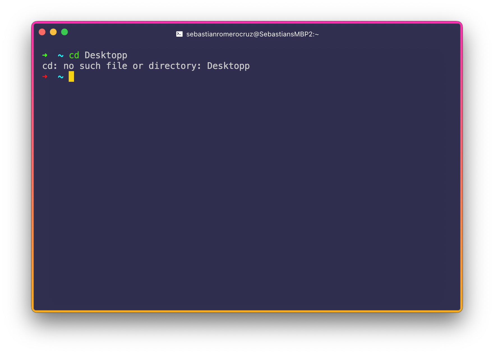

<h2 align=center>Week 01</h2>

<h1 align=center>Setting Up, Unix Intro, <code>gcc</code> Intro, Hello Worlding</h1>

<p align=center><strong><em>Song of the day</strong>: <a href="https://youtu.be/f_G43LhHEos"><strong><u>Burgundy Red</u></strong></a> by 落日飛車 (SUNSET ROLLERCOASTER) (2016)</em></p>

### Sections

1. [**Hello, Professor!**](#part-1-textures)
2. [**A Quick (But Completely Essential) Note For Windows-Only Users**](#a-quick-but-completely-essential-note-for-windows-only-users)
3. [**Hello, Unix!**](#hello-unix--c)
    1. [**The Terminal**](#the-terminal)
    2. [**Root Folder**](#root-folder)
    3. [**Creating a File In Our Desktop**](#creating-a-file-in-our-desktop)
4. [**(Real Quick) Hello, C!**](#real-quick-hello-c)
    1. [**Create a C File**](#create-a-c-file)
    2. [**Copy-and-paste The C "Hello, World" Equivalent**](#copy-and-paste-the-c-hello-world-equivalent)
    3. [**Compile and Run Your File**](#compile-and-run-your-file)
    4. [**Troubleshooting (Mostly For Ubuntu)**](#troubleshooting-mostly-for-ubuntu)

### Hello, Professor!

Hey, my name is Sebastián Romero Cruz, and I will be your instructor for this semester's **Fundamentals of Unix and C Programming** class. It's a pleasure having you all here with me, whenever it is that you are watching this. If you are reading these notes, you'll know that I spent a good chunk of time talking about the syllabus, so please refer to that and to its respective [**video**](https://youtu.be/LcTDsHT8M-Q).

There's nothing too much that I want to say about myself that concerns this course too much. Here's some useless data about me, in case you're interested:

- I was born in Mexico City, Mexico.
- I have BSc in chemical engineering (I don't know why, to be honest) and a MSc in computer science, both from NYU.
- I've been teaching programming at various university levels since 2020.
- Outside of programming, I like reading novels, listening and playing music, and watching slice-of-life anime.

Alright, with that out of the way, let's start off simple this week–nothing too crazy.

### [**A Quick (But Completely Essential) Note For Windows-Only Users**](https://youtu.be/dEk4XLV_9II)

As this class half about getting familiar with Unix-based operating systems, you will need to find a way to run one. MacOS and Linux are both Unix-based, so they're good to go, but as Windows isn't, we need to find options. Here's what I recommend:

- If one of your friends/family members can lend you a computer running MacOS (i.e. a Mac), you're all set and you can skip to the next section. If this isn't an option for you, then...
- You will need to run a Unix-based operating system on a [**virtual machine (VM)**](https://youtu.be/yIVXjl4SwVo?si=ke772w-LL6x8DRlX). In order to achieve this, please follow the steps of the following two videos:
    1. [**How to Install VirtualBox on Windows 11**](https://youtu.be/F_RsnnPk3Tk?si=vtKhhqA_j7ug9jW8)
    2. [**Ubuntu 22.04 In VirtualBox - The Complete Guide**](https://youtu.be/rJ9ysibH768?si=jXlYPBuZn7A1e1xJ)

**Please do this as soon as possible** and, if you're still running into problem after watching these, [**please let me know**](mailto:sromerocruz@pace.edu) so I can point you to the right resources/people. I'm unfortunately quite rusty on Windows, so I want to make sure nobody gets left behind.

### Hello, Unix & C!

We don't actually make a deep dive in the C programming language until the second half of the semester, but I think writing the canonical `Hello, World!` program in it would be a good to get our feet wet in how both the language looks and how Unix-based OSs work.

#### [**The Terminal**](https://youtu.be/R6ADzC7lrO4)

Generally speaking, most users of modern computers interact with software through a graphic user interface (GUI). This means that instead of having to literally instruct your software and/or hardware to do something, you have more intuitive ways of doing so like clicking on buttons with your mouse. For example, if I wanted create a simple Python file on my computer using VSCode and run it, I would do something like the following:


<sub>**Figure 1**: Creating, writing, and running a Python file using nothing but VSCode's GUI.</sub>

Now, there's nothing inherently _wrong_ with doing things this way. Up until this point in your programming career, you might have been programming exclusively this way. But at a certain point, every programming should become familiar with ways to work their computers without relying on pretty buttons to do all their commands for them. The goal for us here is to be able to interact with out operating system as closely as possible, **giving it commands directly instead of relying on software to do it for us**. This way, we can have much finer control of how files, operations, and security works in our machines.

The way we do this in Unix is using our Terminal (the command line, in Windows). Go ahead and open your Terminal application, which exists in both [**MacOS**](https://www.howtogeek.com/682770/how-to-open-the-terminal-on-a-mac/) and [**Ubuntu**](https://www.howtogeek.com/686955/how-to-launch-a-terminal-window-on-ubuntu-linux/):

<sub>**Note**: If you see some visual differences between your Terminal and my screenshots below, it's because I use something called [**Hyper**](https://hyper.is/), which is a highly-customizable Terminal clone. I suggest you stick with your OS's native Terminal for now.</sub>


<sub>**Figure 2**: A beautiful, fresh new Terminal window.</sub>

Believe it or not, but from this super simple application, we can match (and even eventually supersede) our efficiency as programmers–and all you need is to know how to use a few simple commands!

<sub>**Note**: Well, that, and a _lot_ of practice with them. But you'll get there.</sub>

#### Root Folder

So, how on earth do we do this? If you look at figure 2 above, what that `~` right there is telling us is that our Terminal has our computer's **root folder as its present location**. We'll go into much further depth of the Unix file and folder structure, but for now, you can consider this folder as the _folder that holds literally all of the files necessary to run your operating system_.

To give you an idea of how important this is, consider the fact that Apple products don't even let you see this folder through its GUI. We're more-or-less used to considering our Deskop and/or Documents folders as our "main" folders, and those are the ones that Mac's GUI readily shows you:


<sub>**Figure 3**: The first thing that shows up when I open Finder (Mac's file system organiser) is my Desktop, as if it's the single most important folder for us to consider.</sub>

What's important to now realise is that your desktop folder is actually _a sub-folder of your root folder_. This places it higher in the hierarchy of "importance," in a way. Your computer can _technically_ work without a Desktop folder, but _definitely_ can't without a root folder.

#### [**Creating a File In Our Desktop**](https://youtu.be/6_z0hftaMug)

While it's perfectly possible to work in the root folder, it's probably a bit more manageable to work in a more familiar location, such as our Desktop. So, let's tell our Terminal to **switch locations to one of the sub-folders of our present location (the root folder)**. We do this using the **change directory, or `cd`, command**, followed by the address of the folder/directory we wish to change over to:

```sh
cd Desktop
```

Once you do this, your Terminal will now look something like this:


<sub>**Figure 4**: Notice that the `~`, which signifies the root directory, has now been replaced by `Desktop`.</sub>

The reason why this works so simply is because `Desktop` is a direct sub-folder of `~`, so you don't need to make any further specifications as to where exactly `Desktop` is located (we'll look at more complicated examples later).

If, for whatever reason, you try to `cd` into a folder/directory that doesn't exist, you will see the following error:



<sub>**Figure 5**: Don't panic. Just check your spelling, etc..</sub>

---

Now that we're in our Desktop, the only thing we need to do in our Terminal to **create _any_ file is to use the `touch` command**, followed by the name and extension of the file we wish to create. Let's recreate our exercise from figure 1 by creating `hello_world.py`:

```sh
touch hello_world.py
```

Once we do this, you should see the file appear in your Desktop:


<sub>**Figure 6**: Magic? No, just your Terminal, which is basically the same thing.</sub>

Let's quickly open that file and write `print("Hello, World!")` in it. You can do this, if you like, by simply double clicking on the file and using your favourite text editor. _Or_ you can open it directly through your Terminal, as such:

```sh
open hello_world.py -a Visual\ Studio\ Code 
```

<sub>**Note**: There's a reason why I have to include `\` wherever there is a space in the Terminal. We'll discuss that some other time.</sub>

The **`-a` section of this command, called a flag**, stands for "application", so you can basically read this as:

> **Open** the file `hello_world.py` using the **application** _Visual Studio Code_.

---

Anyway, once you've done this, we can run this file right from our Terminal. In the case of Python, the way to do this is by using the following command:

```sh
python3 hello_world.py
```

And voilà!


<sub>**Figure 7**: Our result is displayed right on our terminal.</sub>

Congrats! Your journey into working with Unix-based operating systems has officially begun! If you want to clear your terminal of all of its current contents, you can just go ahead and use the `clear` command:

```sh
clear
```

### [**(Real Quick) Hello, C!**](https://youtu.be/3t0XcS6cE2I)

Like I said earlier, we'll get into actual C programming in the latter half of the semester, but I do want to give your a quick intro on how to run a C file from your Terminal. I'll go into what each of the following commands does next week, but for now, simply:

#### Create a C file

In your desktop, we're gonna go ahead and create a C file using `touch`, like we did before, using the `.c` extension:

```sh
touch hello_world.c
```

#### Copy-and-paste The C "Hello, World" Equivalent

Some of what you'll see in the following code snippet will look very familiar for you from Java, but C has a _lot_ of intricacies that I could spend weeks talking about (and I literally will). For now, go ahead and copy-and-paste the following into your `hello_world.c` file:

```c
#include <stdio.h>

int main(void)
{
    printf("Hello, World!\n");
}
```

#### Compile and Run Your File

In your Terminal, **type** in the following _two commands_. Again, I'll explain what they do and what each part means next week:

```sh
gcc -o HelloWorld hello_world.c
```
```sh
./HelloWorld
```

Output:


<sub>**Figure 8**: Not too different.</sub>

Notice the doing this created an Unix executable in our Desktop as well. More on that next week:


<sub>**Figure 9**: Very Java. Or, rather, Java is very C.</sub>

#### [**Troubleshooting (Mostly For Ubuntu)**](https://youtu.be/msqs1Kh47tY)

If you got an error when trying to compile your C file, please be sure to run the following two commands in your Terminal. Please be aware that each command may take a while to execute, so don't worry if it takes a long time or if you see a bunch of text appear on your terminal:

```sh
sudo apt update
```
```sh
sudo apt install build-essential
```

Once both commands are done, check that the installation of `gcc` is complete by running the following command:

```sh
gcc --version
```

If you see the following data, or something similar, in your terminal you're all set to try and run your C file again:

```
gcc (Ubuntu 9.3.0-10ubuntu2) 9.3.0
Copyright (C) 2019 Free Software Foundation, Inc.
This is free software; see the source for copying conditions.  There is NO
warranty; not even for MERCHANTABILITY or FITNESS FOR A PARTICULAR PURPOSE.
```