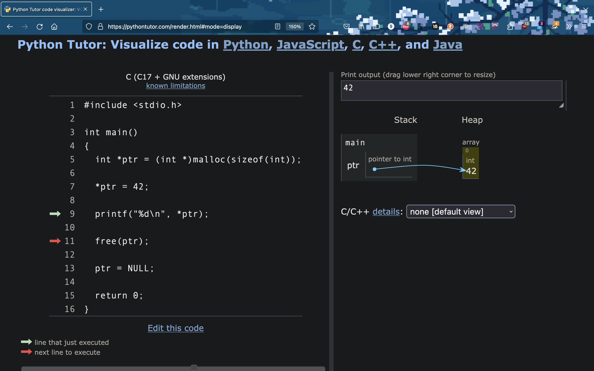

<h2 align=center>Week 13</h2>

<h1 align=center>Dynamic Storage, <code>malloc</code>, <code>calloc</code>, <code>free</code>, Memory Leaks</h1>

<p align=center><strong><em>Song of the day</strong>: <a href="https://youtu.be/S3iQmXaVr7I?si=mzPmfMDrdgkIldBG"><strong><u>Green</u></strong></a> by 12BH (2023)</em></p>

---

### Sections

1. [**Dynamic Storage**](#dyn-mem)
2. [**_`malloc`, `calloc`, and `free`_**](#malloc)
3. [**Memory Leaks**](#leak)

---

<a id="dyn-mem"></a>

### Part 1: _Dynamic Storage_

Dynamic memory in C allows for the allocation and deallocation of memory during runtime. This is particularly useful when the size of memory needed is not known at compile time, or when the memory needs to be shared among different parts of the program.

When dynamically allocating memory in C, the `malloc()` function is typically used (we'll explain this function in much further detail below). The syntax for `malloc` is as follows:

```c
ptr_type *ptr = (ptr_type*) malloc(BYTE_SIZE);
```

Here, `ptr` is a pointer to the block of memory allocated, `ptr-type` is the type of data to be allocated, and `BYTE_SIZE` is the number of bytes to be allocated. Recall [**how many bytes each data type has**](https://github.com/sebastianromerocruz/CS271-material/tree/main/lectures/week-8#int).

Here are some examples using some diagrams:

1. Initially, the memory looks like this. This is memory that was reserved during _compile_ time, and thus is static:

    ```
    _______________________________
    |            Stack            |
    |_____________________________|
    ```

2. If we need a specific chunk of memory allocated during _runtime_, we use `malloc()` to allocate memory for an integer (e.g., `malloc(sizeof(int))`); the memory now looks like this:

    ```
    _______________________________
    |            Stack            |
    |_____________________________|
    |             Heap            |
    |-----------------------------|
    |          |    |             |
    |   int    |    |             |
    |          |    |             |
    |-----------------------------|
    ```

3. When we assign a value to the dynamically allocated memory, the memory would look like this:

    ```
    _______________________________
    |            Stack            |
    |_____________________________|
    |             Heap            |
    |-----------------------------|
    |          |    |             |
    |   int    | 10 |             |
    |          |    |             |
    |-----------------------------|
    ```

4. To deallocate the dynamically allocated memory, we use the `free()` function. The syntax for `free()` is:

    ```c
    free(ptr);
    ```

    After deallocating the memory, the memory would look like the initial state with no memory allocated for the integer:

    ```
    _______________________________
    |            Stack            |
    |_____________________________|
    ```


So, in its entirety:

```c
#include <stdio.h>

int main(void)
{
    // Dynamically allocating memory for an integer
    int *ptr = (int *) malloc(sizeof(int));

    // Filling in that memory with an actual integer
    *ptr = 42;

    // Using the value being pointed to by ptr pointer
    printf("%d\n", *ptr);

    // Deallocating/freeing up the memory allocated earlier
    // since we no longer need it
    free(ptr);

    // free() only deallocates the memory, but does not 
    // destroy the pointer. This is potentially dangerous
    // (we'll see why later) so let's set this pointer to
    // null
    ptr = NULL;

    return 0;
}
```

We can also see this process through our handy-dandy [**code visualiser**](https://pythontutor.com/visualize.html#mode=edit):




<sub>**Figures 1-3**: As you can see, deallocating memory can have its dangers if you don't properly clean up the pointer by setting it equal to `NULL`.</sub>

Let's take a moment and discuss these functions in more detail.

<br>

<a id="malloc"></a>

### Part 2: _`malloc`, `calloc`, and `free`_

As we've just seen, `malloc`, `calloc`, and `free` are functions that are in C for dynamic memory allocation and deallocation.

1. **`malloc`**: 
    `malloc` stands for _memory allocate_. It is used to allocate a block of memory of a specified size in _bytes_. The function signature for `malloc` is:
    ```c
    void *malloc(size_t size);
    ```
    where `size` is the number of bytes to be allocated. `malloc` returns a _`void` pointer_ to the beginning of the allocated memory block.

    Example of using `malloc` to allocate memory for an integer:
    ```c
    int *ptr = (int *) malloc(sizeof(int));
    ```
    Here, the reason why we add the `(int *)` is because we want to cast `malloc`'s `void` pointer into an `int` pointer, which is what we are looking for. 
    
    
    Now, it is worth mentioning here that the function `sizeof()` returns the size of its argument in _bytes_. In other words, we're asking `sizeof` to return the amount of bytes in a single integer so that we can allocate exactly that much memory.

    
    Visually, the memory allocated using `malloc` can be represented as follows:
    ```
    ------------------------------
    |           |                  |
    |   ptr     |      allocated   |
    |           |      memory      |
    ------------------------------
    ```

2. **`calloc`**:
    `calloc` stands for _contiguous allocate_. It is used to allocate a block of memory for an _array_ of elements, with all elements initialized to _zero_. The signature for `calloc` is:
    ```c
    void *calloc(size_t num, size_t size);
    ```
    where `num` is the number of elements and `size` is the size of each element. `calloc` returns a void pointer to the beginning of the allocated memory block.

    Example of using `calloc` to allocate memory for an array of integers:
    ```c
    int *arr = (int *) calloc(5, sizeof(int));
    ```
    Visually, the memory allocated using `calloc` can be represented as follows:
    ```
    ------------------------------
    |   arr[0]  |   arr[1]  | ...  |
    |           |           |      |
    ------------------------------
    ```

3. **`free`**:
    `free` is used to _deallocate the memory_ that was previously allocated using `malloc` or `calloc`. The signature for the `free` function is:
    ```c
    void free(void *ptr);
    ```
    where `ptr` is the pointer to the memory block that is to be deallocated.

    Example of using `free` to deallocate memory:
    ```c
    free(ptr);
    free(arr);
    ```

After calling `free`, the memory block is deallocated and can be reused for future allocations. This means that _the pointer itself is not actually destroyed_, and thus you now have a pointer pointing to basically no data (or a random piece of data in your computer), which is, of course, really dangerous. This can lead to something called a _memory leak_, which we'll discuss next:

<br>

<a id="leak"></a>

### Part 3: Memory Leaks

Memory leaks occur in C when dynamically allocated memory is not properly deallocated after it is no longer needed, causing the program to _lose access to that portion of memory_. What happens then is that we gradually lose the amount of available memory, potentially leading to performance issues or even crashing the program if all available memory is consumed by these leaks.

One common way memory leaks can happen is when the `malloc()` function is used to allocate memory, but the `free` function is not called to release that memory when it is no longer needed. This can happen if a pointer to the allocated memory is lost, overwritten, or not properly tracked by the program.

Here is an example demonstrating how a memory leak can occur:

```c
#include <stdlib.h>

int main() {
    int *ptr = (int*)malloc(sizeof(int)); // allocate memory
    *ptr = 10;
    
    // memory is not freed
    return 0;
}
```

In the example above, memory is allocated using `malloc` to store an integer value, but the allocated memory is not released using `free` before the program exits. This results in a memory leak, as the program no longer has access to the allocated memory after it finishes executing.


<sub>**Figure 4**: When our `main()` function finishes, the memory allocated by it remains reserved. This can be a big issue if we're constantly dynamically allocating memory and not releasing it, as we can quickly run out of memory.</sub>

Another common way memory leaks can occur is when dynamically allocated memory is freed more than once, causing memory corruption or undefined behavior. This can happen if the same memory address is passed to the `free` function multiple times, or if the program tries to access memory that has already been freed.

Here is an example demonstrating how a double free can lead to memory leaks:

```c
#include <stdlib.h>

int main() {
    int *ptr = (int*)malloc(sizeof(int)); // allocate memory
    *ptr = 10;
    
    free(ptr); // free memory
    free(ptr); // double free
    
    return 0;
}
```

In this example, the memory allocated for the integer value is freed twice, causing a memory corruption issue. Double freeing memory can lead to memory leaks, as well as potentially crashing the program due to accessing invalid memory locations:


<sub>**Figure 5**: Example of the aforementioned error.</sub>

To prevent memory leaks in C, it is important to always pair calls to `malloc` with corresponding calls to `free` when the allocated memory is no longer needed. 

Additionally, it is good practice to set pointers to `NULL` after freeing the memory to prevent accidental use of invalid memory addresses. For example:

```c
#include <stdio.h>
#include <stdlib.h>

int main(void)
{
    // Get length of name from user
    int name_length;

    printf("How long is your name? ");
    scanf("%d", &name_length);

    // Allocate that many char-sized chunks of data
    char *name = (char *) calloc(name_length + 1, sizeof(char));

    // Get name from user as a string
    // We are guaranteed to have enough space for it
    // since we dynamically allocated `name` according
    // to the expected size of name
    printf("What is your name? ");
    scanf("%s", name);

    // print name
    for (int i = 0; i < name_length; i++) printf("%c", name[i]);

    // free data allocated for `name`
    // and set free `name` pointer to
    // NULL
    free(name);
    name = NULL;

    return 0;
}
```

Potential output:

```
➜  gcc -o DynamicNames dynamic_name.c
➜  ./DynamicNames                    
How long is your name? 9
What is your name? Sebastian
Sebastian
```