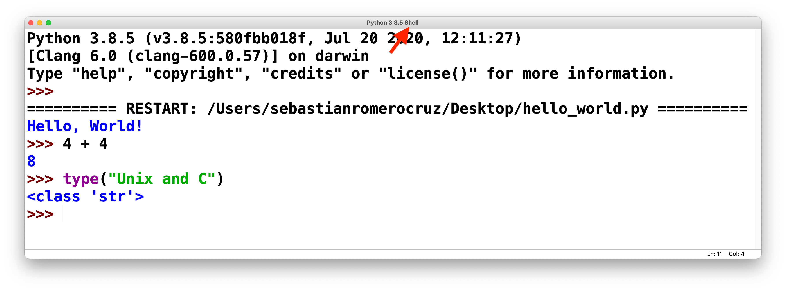
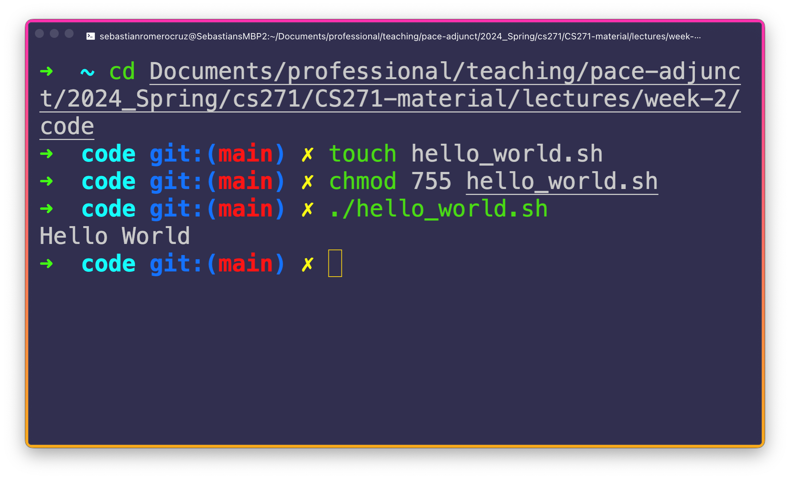
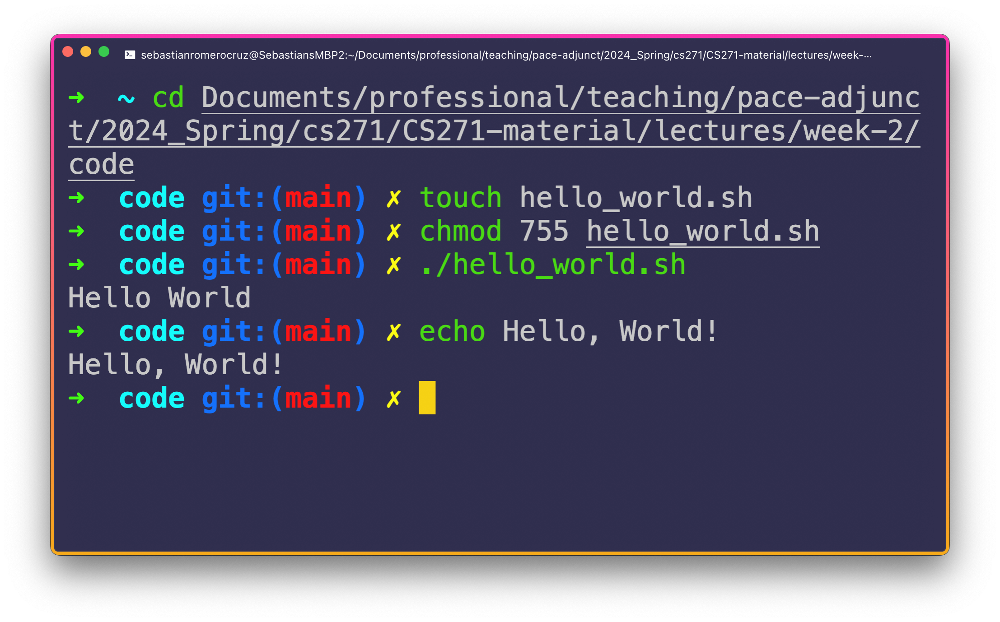

<h2 align=center>Week 02</h2>

<h1 align=center><code>gcc</code> Usage, Unix/C History, Intro to Shell Scripting</h1>

<p align=center><strong><em>Song of the day</strong>: <a href="https://youtu.be/f_G43LhHEos"><strong><u>Burgundy Red</u></strong></a> by 落日飛車 (SUNSET ROLLERCOASTER) (2016)</em></p>

### Sections

1. [**The GNU Compiler Collection, or `gcc`**](#the-gnu-compiler-collection-or-gcc)
2. [**Some Unix/C History**](#some-unixc-history)
3. [**Intro to Shell Scripting**](#intro-to-shell-scripting)
    - [**What _Is_ a Shell?**](#what-is-a-shell)
    - [**Navigate To Your Desired Directory**](#navigate-to-your-desired-directory)
    - [**The Code**](#the-code)
    - [**The Execution**](#the-execution)

### The GNU Compiler Collection, or `gcc`

Alright, let's take a bit of a closer look at the commands that we used last week to compile our C program, `hello_world.c`:

```sh
gcc -o HelloWorld hello_world.c
```

We certainly see the name our file tacked on at the end but, unlike the simple `python3` directive we used to run a Python program, we had to use a number of other directives, flags, and terms. Let's start from the beginning, and talk about what `gcc` is in the first place.

---

**`gcc`** stands for **GNU Compiler Collection** and, as the name implies, it is a compiler. It's by far one of the most widely used open-sourced compilers and it supports various programming languages, including C, C++, Objective-C, Fortran, Ada, etc.. Of course, we only need it for C in this class. You can think of `gcc` as an analogy of `python3`.

The basic usage of `gcc` involves providing it with the source code file (or files) and compiling them into executable files. The general syntax is as follows:

```sh
gcc [options] [source files] [libraries]
```

So, what we're looking at here:

```sh
gcc -o HelloWorld hello_world.c
```

Breaks down to:
- Specifying our compiler by typing **`gcc`**.
- Using the **`-o <output>`** flag, which specifies the output filename for the compiled program. Here, I chose the name `HelloWorld` as the name of the executable, but you can use pretty much any name that you want.

There's some additional stuff we can do with `gcc`, which are not super necessary right now, but I'll leave them here for reference.

If you have multiple source files, you can list them all together:

```
gcc file1.c file2.c -o program
```

If you only want to compile the files without linking them into an executable, use the `-c` option:

```
gcc -c file.c
```

Additional libraries may be required depending on the code you're compiling. You can specify them using the `-l` option followed by the library name. For example:

```
gcc file.c -o program -lm
```

This links the math library (`libm`) with the compiled program.

### Some Unix/C History

The development of the Unix operating system and the C programming language began a _looooooong_ time ago. Tracing its origins to Bell Labs in the late 1960s. There, a team of some of _the_ computer science giants (such a Dennis Ritchie, Ken Thompson, and Brian Kernighan) set out to build an operating system for the DEC PDP-7 computer. 


Their first attempt was, as was the mode at the time, to create an assembly language-based called [**Multics**](https://en.wikipedia.org/wiki/Multics). Now, if you've ever seen or worked with assembly language, you can probably imagine what nightmare programming an entire operating system in it would be. It turned out that it was, in fact, too slow and complex.

So, Ken Thompson and Dennis Ritchie, they set out to create a simpler and more efficient alternative. This led to the birth of [**Unix**](https://en.wikipedia.org/wiki/Unix) in 1969. 

<sub>**Note**: The 60s gave us Aretha Franklin, Sgt. Pepper, and Unix. What a time.</sub>

Now, as you probably already guessed, what set Unix apart was the language that harnessed its elegance and efficiency. Alongside assembly, there was a need to create a language that could provide low-level access to the hardware, while also being portable across multiple computer systems. And thus, Ritchie's [**C**](https://en.wikipedia.org/wiki/C_(programming_language)) was born. The question that I often get is why C is called the way it is. It's actually rather simple: it's a successor of Thomson's and Ritchie's earlier language, which is called (I kid you not) [**B**](https://en.wikipedia.org/wiki/B_(programming_language)).

<sub>**Note**: Mysteriously, there doesn't seem to be an _A_ programming language.</sub>

This UNIX and C duo proved crucial as Unix began to spread beyond Bell Labs and found its way into academic institutions and, eventually, commercial use. C soon became the language of choice for systems programming, as it provided low-level control, efficiency, and was much more user-friendly than assembly language.

The impact of Unix and the C language on the computing world trully cannot be overstated–in some ways, their story _is_ the story of computer science. For its part, Unix set the standard for the way operating systems are built: modularity, simplicity, and easy communication between programs became the rule. As for C, its ubiquity has made it into the de facto lingua franca of programming languages. Most of the modern languages that you are familiar with–Python, Java, Javascript, etc.–owe their existence and syntax to the C language. We should all remember whence we came.

None of this is to say that either Unix or C are out of use–the opposite is true. Like I've mentioned before, MacOS and every Linux distribution (like Ubuntu) are all programmed, maintained, and updated in C. Bash programming (what we'll start next) also happens to [**pay pretty well**](https://insights.stackoverflow.com/survey/2020#top-paying-technologies).

Hence the reason this for class's existence. Provided that you're sufficiently convinced (and even if you're not, you still have to take an exam on it), let's look some shell scripting.

### Intro to Shell Scripting

#### What _Is_ a Shell?

...which probably warrants the question: what even _is_ a shell? If you've ever used Python's IDLE interpreter before, you know that it comes with its own shell:



<sub>**Figure 1**: The Python shell is where see the output of our programs, and can test various aspects of the language.</sub>

Our **Terminal**, in fact, is simply _a piece of software which runs a different type of shell_ (a kind of GUI, funnily enough). Seems like a whole lot of what we're doing here revolves around this idea of the shell. So what is it? A **shell** is simply the program that actually _processes all the commands that we give it and, if necessary, returns an output to us_. It manages a bunch of background processes, command history, and command line editing. These, and many more, are standard operations in **`bash`**, which is the most common shell in modern linux systems.

Thus far, we've looked at two `bash` commands: 

- **`cd` (change directory)**: Changes location to the address entered after `cd`.
- **`touch`**: Creates a file with the name entered after `touch` in the current directory.

These commands are two of the most common ones, and for good reason. We use them a ton, and we'll learn about a bunch more next week too but, again, just to wet your feet a little into shell programming, let's try creating a "Hello, World!" program in the form of a shell script. Because, believe it or not, you, too, can create your own Terminal commands!

#### Navigate To Your Desired Directory

Start by navigating to whichever folder you would like to create this script. In my case, I'm going to save it in this lecture's `code` folder, but for you it will be different:

```bash
cd Documents/professional/teaching/pace-adjunct/2024_Spring/cs271/CS271-material/lectures/week-2/code 
```

<sub>**Note**: Notice how I can chain subfolders by using a forward slash `/`. This way, you don't have to use `cd` for every single directory change you make. I love organising my life around folders, so I have a ton of them lol.</sub>

#### Create a Shell Script

Next, we want to go ahead and use `touch` to create a shell scripting file. The extension for these is `sh`:

```bash
touch hello_world.sh
```

#### The Code

While we have a full two weeks dedicated to shell programming, I'll introduce a couple of things with this very simple program. So, open the [**file**](code/hello_world.sh) up in your favourite IDE, and go ahead and type the following lines, careful not to mispell anything:

```sh
#!/bin/sh
# You can write comments this way...
echo Hello World        # ...and this way as well
```

Let's go line by line here:

1. **`#!/bin/sh`**: This line instructs your operating system to execute the following programby `/bin/sh`. In almost every Unix-based file system, this is the standard location of our link to `bash` (more on file systems coming in week 3).
2. **`# You can write comments this way...`**: Pretty self-explanatory–just wanted to make you aware of how to do it. You might have noticed that the line above also starts with a `#`, but since it is directly followed by the `!`, telling Unix to interpret it in a special way.
3. **`echo Hello World`**: The `echo` command tells the shell to literally echo back to use whatever arguments we place after it. In this case, our argumens are `Hello` and `World`. `echo`, just like Python's `print` function's `,`, will place a space between its arguments.

### The Execution

To execute our shell script, we need to execute two commands on the terminals. First, we have have to give the user (us) read, write, and execute Unix permissions (see what I mean now with how the Terminal gives us finer control of our computer's security?). We do this via the following command:

```bash
chmod 755 hello_world.sh
```

Doing this allows us to consider our file to be an executable. You can find an in-depth explanation of why this command works the way it does [**here**](https://codefather.tech/blog/chmod-755-command/).

With that out of the way, go ahead and run your file (very similar to how ran our C executable):

```bash
./hello_world.sh
```

And we should see our output pop out!



<sub>**Figure 2**: Note here that the reason why I have that `git:(main) ✗` tacked on to my current directory is because this particular folder is linked to a GitHub repository (i.e. the one that you are reading right now).</sub>

Now, making a whole script just to print out "Hello, World!" is a bit silly, since it involves only one command (`echo`). You can just as easily use that directly:



<sub>**Figure 2**: An exercise in futility? No; everything has a purpose.</sub>

But, like I said, baby steps. Next week, we'll be taking a look at a bunch more commands for you to use and become a Terminal pro.