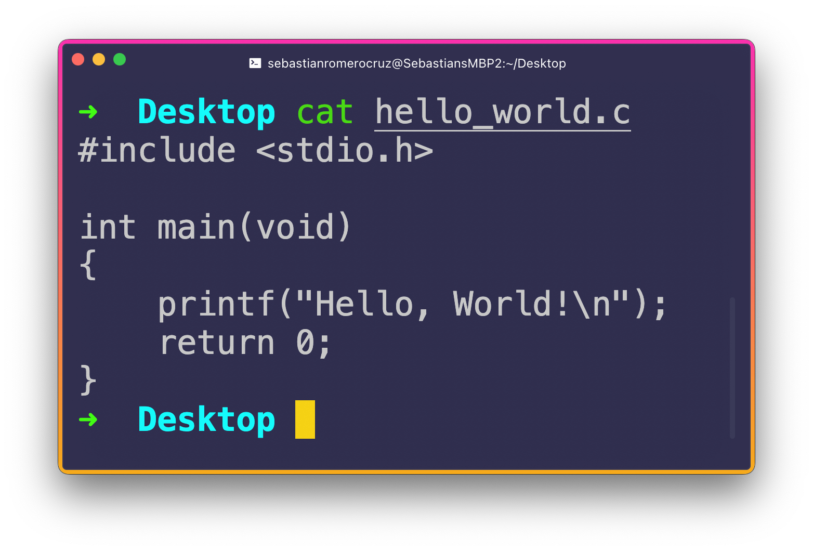
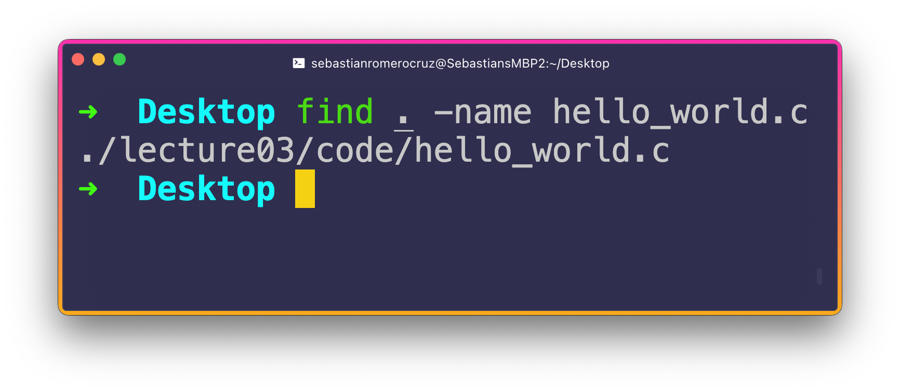
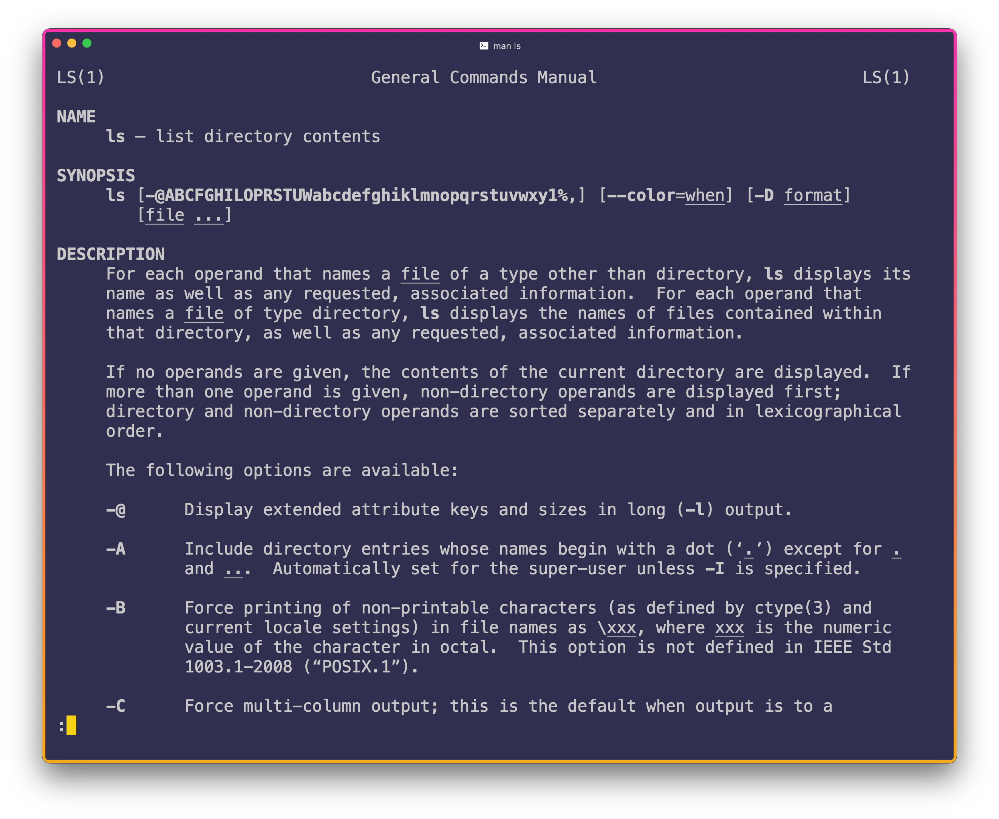
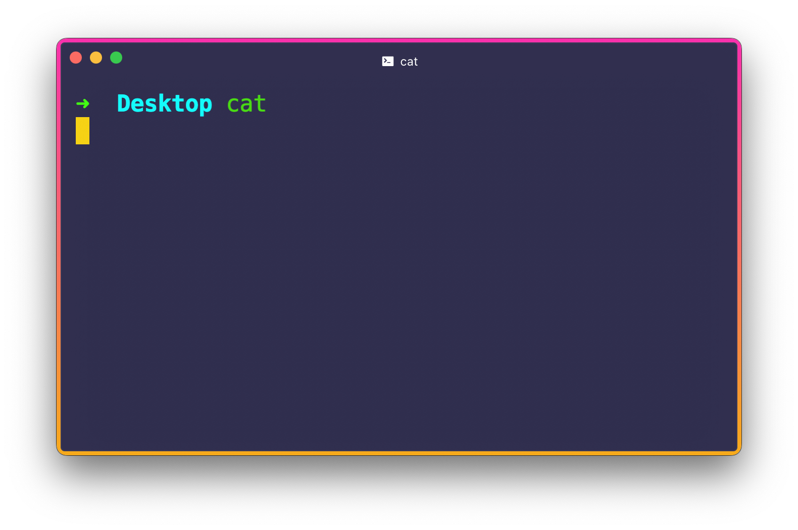
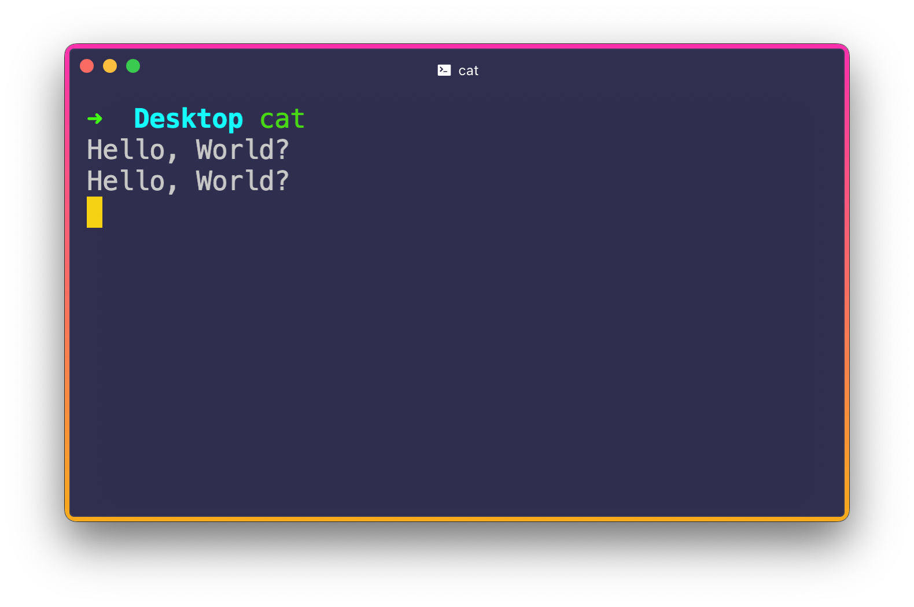
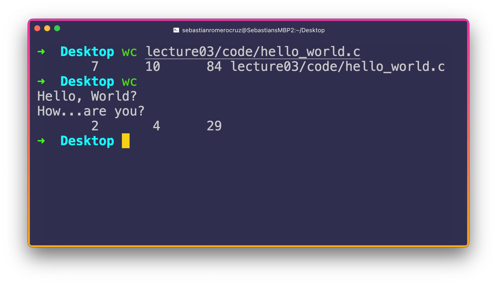
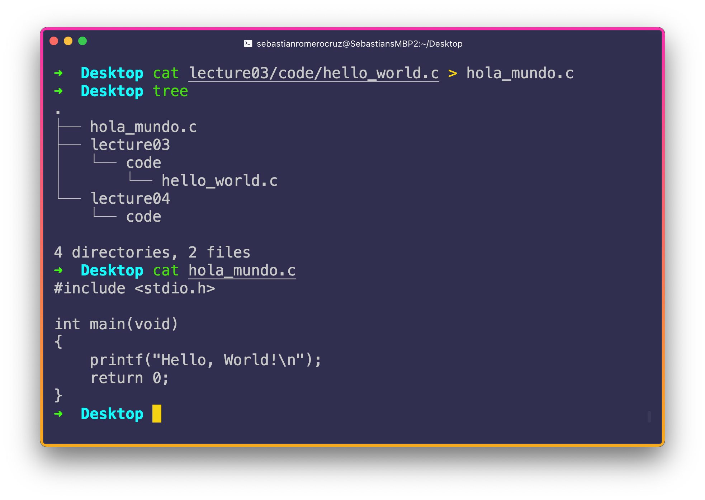
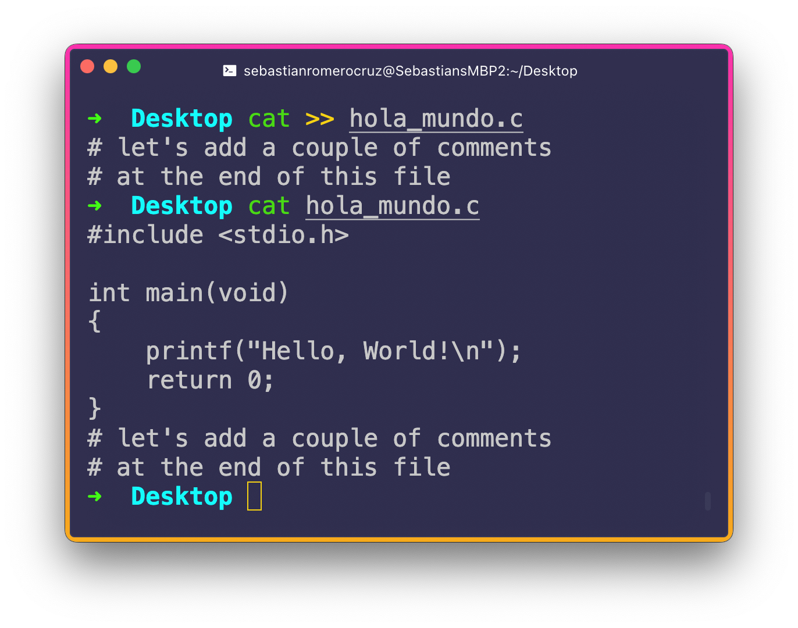
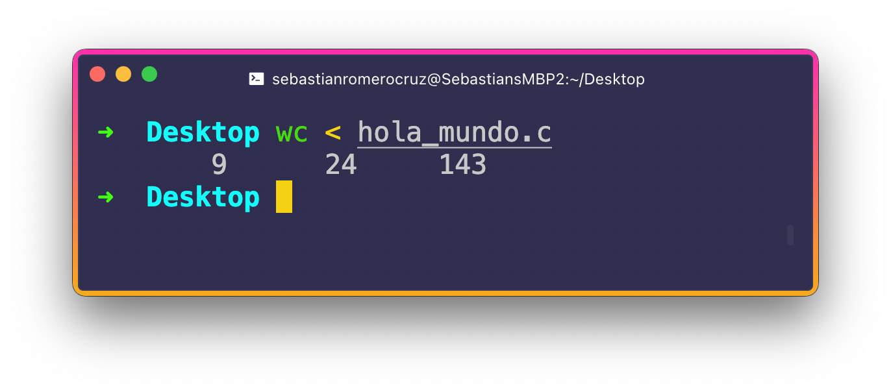
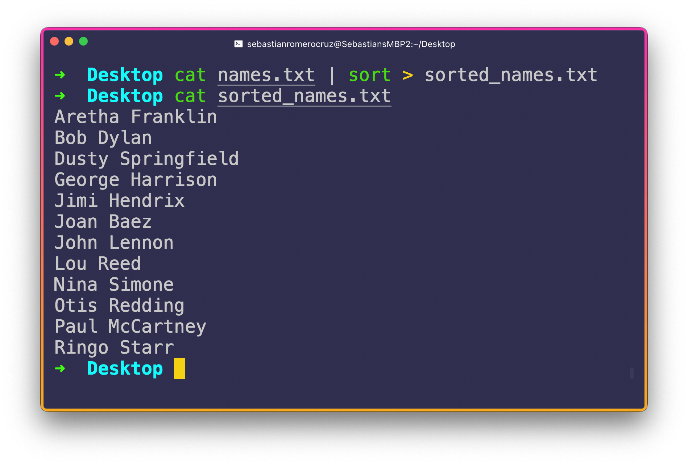

<h2 align=center>Week 03</h2>

<h1 align=center>Basic Commands, Manual Pages, Standard I/O, Command Piping</h1>

<p align=center><strong><em>Song of the day</strong>: <a href="https://youtu.be/f_G43LhHEos"><strong><u>Burgundy Red</u></strong></a> by 落日飛車 (SUNSET ROLLERCOASTER) (2016)</em></p>

### Sections

1. [**A Glossary Of Common Terminal Commands**](#a-glossary-of-common-terminal-commands)
    - [**`mkdir` (Make Directory)**](#mkdir-make-directory)
    - [**`ls` (List)**](#ls-list)
    - [**`cat` (Concatenation)**](#cat-concatenate)
    - [**`mv` (Move)**](#mv-move)
    - [**`find`**](#mv-move)
2. [**Manual, or Man, Pages (`man`)**](#manual-or-man-pages-man)
3. [**Standard IO**](#standard-io)
    - [**Using `cat` As An Example**](#using-cat-as-an-example)

### A Glossary Of Common Terminal Commands

This week, we're going to check out a few of the many, many, _many_ Terminal commands that I believe are indispensible for you to know right now. Over the course of the semester, we will be introducing more (as we will be delving deeper into how they actually work), but getting some early practice with these will strengthen your Terminal prowess significantly.

#### [**`mkdir`**](https://www.man7.org/linux/man-pages/man1/mkdir.1.html) (Make Directory)

As the name implies, `mkdir` is the command you want to use if you want to create a folder/directory. It takes one argument, which is the desired name of the directory you are trying to create. So, for instance, if I were trying to create a folder called `lecture03` in my present directory, I would simply type the following line on my Terminal:

```bash
mkdir lecture03
```

So, our directory structure would now look like this (where `.` represents our current directory):

```
.
└── lecture03

1 directory, 0 files
```

To create directories inside _existing_ directories, you simply have to specify the address within those directories:

```bash
mkdir lecture03/code
```
```
.
└── lecture03
    └── code

2 directories, 0 files
```

One final option (for now) you can use applies in the situation where you want to create a directory inside of another directory, but _the parent directory doesn't yet exist_. For example, if I wanted to create a `code` folder inside another folder called `lecture04` (which doesn't yet exist), I would have to use the **`-p` (parents) option/flag** in my command, as follows:

```bass
mkdir -p lecture04/code
```

```
.
├── lecture03
│   └── code
└── lecture04
    └── code

4 directories, 0 files
```

Note that if you _don't_ use `-p`, you will get the following error:

```
mkdir: lecture04: No such file or directory
```

#### [**`ls`**](https://www.man7.org/linux/man-pages/man1/ls.1.html) (List)

I use the `ls` command so much in my daily life that, to be honest, I don't even notice when I do so anymore. It truly is an essential. At its simplest usage, `ls` lists the current directory's contents. So, if I were to use it with the directory I used to explain `mkdir`:

```bash
ls
```

I would see:

```
lecture03 lecture04
```

Since those two folders constitute the contents of my current directory. Note that it doesn't show those two sub-folders' contents. If you would like the Terminal to give you a more detailed listing of the contents, you can use the **`-l` (long) option/flag**:

```bash
ls -l
```
```
total 0
drwxr-xr-x  3 sebastianromerocruz  staff  96 Jan 15 13:10 lecture03
drwxr-xr-x  3 sebastianromerocruz  staff  96 Jan 15 13:14 lecture04
```

The information you see above pertains to the contents' permissions, owners, dates of creation, names, and the amount of non-directory files present (0, in this case). There's no need to understand everything right now, but I just want you to be aware of it. In fact, you can use the **`-lh` (list human)** option to literally get a more human-friendly version of `ls -l`, which basically, for now, only includes a more readable version of the contents' size:

```bash
ls -lh
```
```
total 0
drwxr-xr-x  3 sebastianromerocruz  staff    96B Jan 15 13:10 lecture03
drwxr-xr-x  3 sebastianromerocruz  staff    96B Jan 15 13:14 lecture04
```

Finally, you should know that Unix-based operating systems always have these hidden files that don't show up neither on your GUI nor on your Terminal by default. To display these, you can use either the **`-a`, `-la`, or `-lha` option** (`a` standing for "all") to display these files as well:


```bash
ls -lha
```
```
total 16
drwx------@  5 sebastianromerocruz  staff   160B Jan 15 13:14 .
drwxr-xr-x+ 68 sebastianromerocruz  staff   2.1K Jan 15 13:38 ..
-rw-r--r--@  1 sebastianromerocruz  staff   6.0K Jan 15 13:06 .DS_Store
drwxr-xr-x   3 sebastianromerocruz  staff    96B Jan 15 13:10 lecture03
drwxr-xr-x   3 sebastianromerocruz  staff    96B Jan 15 13:14 lecture04
```

Turns out we had 16 hidden files, and we didn't even know.

#### [**`cat`**](https://www.man7.org/linux/man-pages/man1/cat.1.html) (Concatenate)

`cat` is a really nice time-saving command. It takes one argument, it being the name of a _file_ and then lists out the _contents_ of that file. I have included our `hello_world.c` program from before in my current directory to demonstrate this:



<sub>**Figure 1**: There's just something so special about having the ability to do this from the Terminal.</sub>

The reason why this might be preferable to simply opening a file in a text editor is because, through `cat`, there is no risk of accidentally modifying the file. This is an extremely important ability to have, especially if the file you inspecting contains information that you can't risk corrupting.

If your file is really long, the **`head`** command will show the _first 10 lines_ of the file, while the **`tail`** command will show you the _last 10 lines_. In both commands, you can also use the **`-n` (number)** option followed by a number to change the number of lines you want displayed.

#### [**`mv`**](https://www.man7.org/linux/man-pages/man1/mv.1.html) (Move)

Like the name implies, `mv` changes the location of a file or a folder from one directory to another. There's a few ways we can format this command, so let's take a look at some.

Let's say I wanted to move `hello_world.c` from my current directory (`.`) into `lecture03/code`:

```bash
mv hello_world.c lecture03/code
```
```
.
├── lecture03
│   └── code
│       └── hello_world.c
└── lecture04
    └── code

4 directories, 1 file
```

And to move it back:

```bash
mv lecture03/code/hello_world.c .
```
```
.
├── hello_world.c
├── lecture03
│   └── code
└── lecture04
    └── code

4 directories, 1 file
```

Interestingly, you can also use `mv` to rename files as you move them. For example, I can rename `hello_world.c` to, say, `hola_mundo.c` without changing directories, you would simply:

```bash
mv hello_world.c hola_mundo.c
```
```
.
├── hola_mundo.c
├── lecture03
│   └── code
└── lecture04
    └── code

4 directories, 1 file
```

Technically, you _are_ making a directory change–from the current directory to the current directory. You can, of course, also perform a name change while performing a more meaningful directory move:

```bash
mv hola_mundo.c lecture03/code/hello_world.c
```
```
.
├── lecture03
│   └── code
│       └── hello_world.c
└── lecture04
    └── code

4 directories, 1 file
```

#### [**`find`**](https://www.man7.org/linux/man-pages/man1/find.1p.html)

This command seems to be especially useful to students who struggle with file systems, since it literally shows you the location of files you just can't seem to find two minutes before the deadline. There's a myriad of ways to use `find`, but for now, you can use the most basic one. Let's say I wanted to find a file called `hello_world.c` in my current directory. You would need to use `find` with the desired directory (in this case `.`), followed by the **`-name` option**. This option should then be followed by the name you want to find:

```bash
find . -name hello_world.c
```



<sub>**Figure 2**: Notice that the whole path is displayed starting from the present directory.</sub>

### Manual, or Man, Pages ([**`man`**](https://www.man7.org/linux/man-pages/man1/man.1.html))

There's apparently a joke amongst Linux users the only Terminal command that you really need to know about is **`man`**. This command stands for manual pages, more commonly known as man pages. Again, like the name implies, this is essentially your **built-in Terminal command manual**. For example, let's say that you want to find out more about the `ls` command, you would simply enter:

```bash
man ls
```

And you would get something like this:



<sub>**Figure 3**: As you can see, your entire Terminal screen gets replaced by the official documentation for `ls`.</sub>

Most, if not all, of these man pages are quite long, so if you want to scroll through them, you can use your arrow keys, `PgUp` and `PgDn` keys (if you have them), and/or your mouse scrolling tool in order to browse it. Once you are done browsing, simply press your **`q`-key to exit**, bringing you back to your Terminal screen.

The importance of `man` probably doesn't need explaining. Beyond this class, you will continue to encounter many more commands and options that I will likely not have the time to cover. So, picking a simple command like `ls` or `cd` and reading through its man page would be a good way get familiar with their lingo and structure.

### Standard IO

One thing we often take for granted that was pioneered by Unix is the way is managed input and output from and to its users. Before Unix, operating systems required programmers to set up connections to the _physical typing machines (teletypes)_ for reading inputs and printing outputs. That is, the pressing of a key was a physical electrical communication to the operating system. This was a very painstaking process, as every computer type required its own custom teletype. Since the goal of Unix was to to portable across multiple machines, it needed a way to both _decouple these physical devices from its operations_ and _make every program read and write from these **"abstract" input and output devices** by default_.

The result is what we call **Standard IO (Input/Output)** where, by default, Unix chooses your keyboard as input and the Terminal as output.

#### Using `cat` As An Example

Let's take the `cat` command as an example. If we use `cat` on our `hello_world.c` from before, we will, as we know, get:


<sub>**Figure 4**: Hello again.</sub>

However, if we simply try entering `cat` _without giving it an argument_ you'll observe the following:



<sub>**Figure 5**: Notice here that `Desktop` hasn't shown up yet in the following line.</sub>

This is because `cat` is actually **waiting you to enter the contents it will then display, instead of getting those contents from a file**. Meaning that, whatever I enter into the terminal, it will simply just `echo` it back to us:



<sub>**Figure 6**: Even after we enter something, `cat` continues prompting us for input.</sub>

We can continue supplying `cat` with more content, or exit back to the command line using `ctrl` + `d`, which sends a sort of end-of-input command to `cat`.

Try doing the same with the command `wc`, which lists out the number of lines, words, and characters in a file:



<sub>**Figure 7**: `wc` might also be useful for you to know.</sub>

### Redirection

You are actually not limited to the _standard_ input/output when dealing with IO. For example, when you use `cat`, the input is either the file that you use as an argument, or your keyboard if you don't provide and argument (see figure 5). The output, in turn is your Terminal, since that is where you see the result of the `cat` command.

What if you didn't want to use the `Terminal` as your output, though? For example, let's say you wanted to take the contents of `hello_world.c` and store them in a file called `hola_mundo.c` somewhere else (say, in the root folder). For an operation like this, we would use the **`>` (output redirection) operator**:



<sub>**Figure 8**: This works because all that `cat` does is take input from one source and puts it somewhere else. Notice, too, that the command I use to get a directory structure is `tree`.</sub>

Now, this worked the way it did because the file `hola_mundo.c` didn't already exist in my desktop, so my OS simply created the file for me. _If the file had already existed, using `>` would rewrite its contents with the contents of `hello_world.c`_.

If you don't want to replace the existing contents of a file, but simply append them at the end, you can use the **`>>` (output append redirection) operator**:



<sub>**Figure 9**: Here, the input is my keyboard, and the output is `hola_mundo.c`.</sub>

---

You can do something similar with input by using the **`<` (input redirection) operator**:



<sub>**Figure 10**: Not a big difference from using `wc` by itself.</sub>

The only difference from simply using `wc` by itself is that the name of the file doesn't show up on the output (see figure 7). Not a big difference, but could certainly be a good interview question.

### Command Piping

The final thing we will be covering this week is something called **command piping**. The name comes from the **pipe character `|`**. Command piping is essentially a way of _chaining the input and outputs of several commands into a single line_. For example, we know that `cat` will output contents of a file. Let's say this file, [**`names.txt`**](assets/names.txt) contains an unsorted list of student names:

```
Joan Baez
Paul McCartney
Nina Simone
John Lennon
Otis Redding
Bob Dylan
Dusty Springfield
Jimi Hendrix
Aretha Franklin
George Harrison
Lou Reed
Ringo Starr
```

Now, let's say I wanted to create a file called `sorted_names.txt` that contains these names, but sorted in lexicographical order (i.e. by their ASCII values). We would need two (and a half) commands for this:

1. **`cat names.txt`**: This line will take the contents of `names.txt` and return them as output.
2. **`sort`**: This command accepts data from an input and returns it sorted lexicographically.
    - **`> sorted_names.txt`**: This operator redirects the output of the previous command to whatever follows the `>` operator. In this case, I chose to redirect it to the `txt` file `sorted_names.txt`.

Using this all together using the `|` operator:



<sub>**Figure 11**: `M A G I C`.</sub>

As you can see, we didn't need to specify neither the output of `cat` nor the input of `sort`, since the pipe operator `|` automatically redirects both for us.