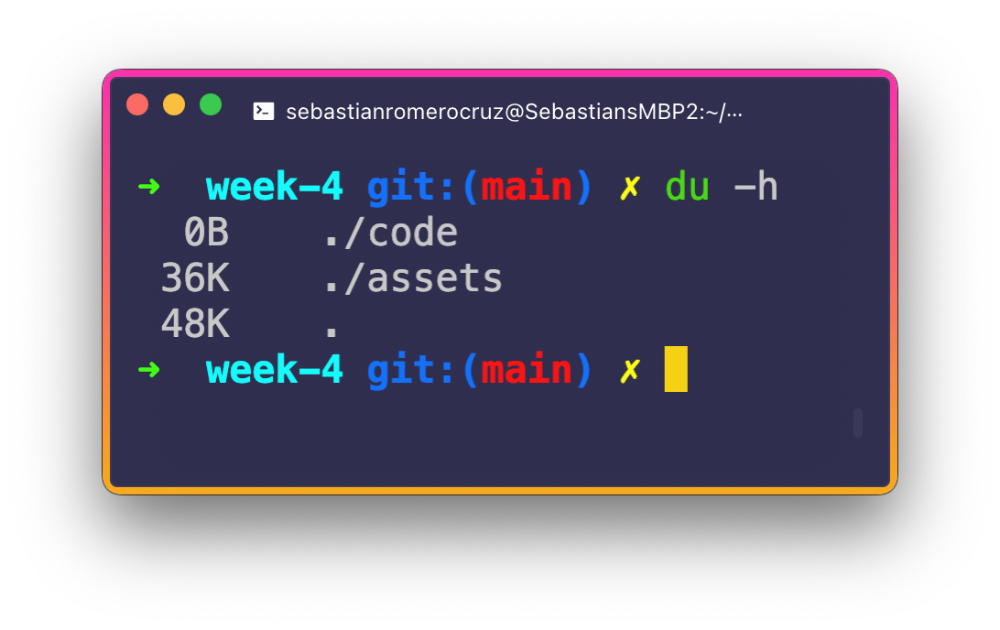
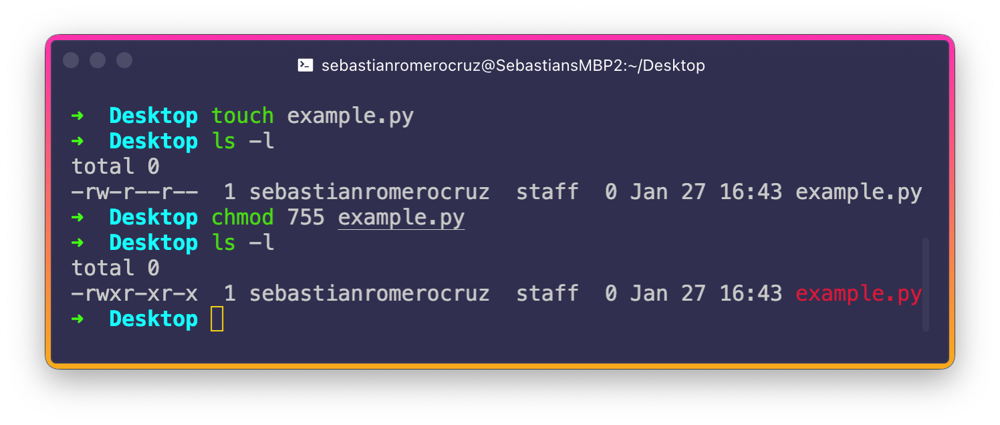

<h2 align=center>Week 04</h2>

<h1 align=center>File Systems, File Names, Directories, Permissions, Inodes</h1>

<p align=center><strong><em>Song of the day</strong>: <a href="https://youtu.be/-UWpbEsj2yA?si=BaUfmDJXznXrC3J7"><strong><u>Sunkissed</u></strong></a> by The Vaccines (2024)</em></p>

### Sections

1. [**File System Basics**](#file-system-basics)
2. [**File Permissions**](#file-permissions)
    - [**Read, Write, and Execute**](#read-write-and-execute)
    - [**Modifying Permissions**](#modifying-permissions)
3. [**Inodes**](#inodes)

### File System Basics

One of the big questions that students of Unix get when starting to explore Unix is about its file system. Even before you start installing applications and creating files, Unix-based operating systems already have quite a complex directory structure containing files that, ideally, none of us ever interact with on a daily basis:


<sub>**Figure 1**: `bin`? `lib`? _What_?</sub>

So what are all these folders for, and what on Earth is in them? Each of these directories has a very specific purpose and, generally speaking, are the same across all major Unix-based operating systems. Here's a table of them, alongside their serial number (see [**part 3**](#inodes) for more on this) and description:

| Serial Number | Directory | Description |
|---------------|-----------|-------------|
| 1 | **`/`** (Root) | Should contain only the directories needed at the top level of the file structure. |
|2|**`/bin`**|Where the OS's executable files are located. These files are available to all users of the computer.|
|3|**`/dev`**|This is where any device drivers (for any external hardware you're using, for instance) are located.|
|4|**`/etc`**|Contains a great variety of things, such as supervisor directory commands, configuration files, disk configuration files, valid user lists, groups, etc.|
|5|**`/lib`**|This directory, as the name implies, contains shared library files.|
|6|**`/boot`**|This is where the files necessary to boot your system are contains.|
|7|**`/home`**|This is the home directory for users of the computer.|
|8|**`/mnt`**|This folder contains files used to mount other temporary file systems to the computer (e.g. `cdrom` for the CD-ROM drive).|
|9|**`/proc`**|This contains processes or other information that is dynamic to the operating system.|
|10|**`/tmp`**|This folder contains some temporary files that are used in OS boots.|
|11|**`/usr`**|There's a bunch of random stuff in here, such as administrative commands, shared files, library files, etc..|
|12|**`/var`**|`var` stands for "variable". Like the name implies, this directory contains variable-length files such as log files and any other type of file that may contain a variable amount of data.|
|13|**`/sbin`**|This contains system administration binary (which is to say, executable) files.|
|14|**`/kernel`**|Contains the kernel (the core of the operating system) files.|

A really handy command when determining how much disk space a specific folder is taking up in your memory is the **[`du` (disk usage)](https://www.man7.org/linux/man-pages/man1/du.1.html)** command. For example, at time of writing, the folder for week 4's lecture notes displays the following:



<sub>**Figure 2**: Note the use of the `-h` (human) tag to display the units of data.</sub>

### File Permissions

#### Read, Write, and Execute

Alright, now for the meat and bones of this week–file permissions. As I keep saying, security is one of the core focii of learning your way around Unix, and permissions are directly responsible with this.

Last week, we saw the following output when listing the contents of our directory on our Terminal:

```bash
ls -lha
```

```
total 16
drwx------@  5 sebastianromerocruz  staff   160B Jan 15 13:14 .
drwxr-xr-x+ 68 sebastianromerocruz  staff   2.1K Jan 15 13:38 ..
-rw-r--r--@  1 sebastianromerocruz  staff   6.0K Jan 15 13:06 .DS_Store
drwxr-xr-x   3 sebastianromerocruz  staff    96B Jan 15 13:10 lecture03
drwxr-xr-x   3 sebastianromerocruz  staff    96B Jan 15 13:14 lecture04
```

That column on the far left, including the letters `d`, `r`, `w`, `x`, etc., is telling us that specific directory or file's specific permissions are. What's more, when we used `chmod` to make our `.sh` file executable, we were also changing its permissions. But, that time, we only used three numbers. What's all this about? Why the different formats, and how do even read them?

We should start by saying that every single file in Unix-base OSs have the following security attributes:

- **Owner Permissions**: As the name implies, these permissions determine what actions the owner of the file can perform on the file.

- **Group Permissions**: These determine what actions any given user, who is a member of the "group" that a file belongs to, can perform on the file. The owner the file, of course, belongs to any of these groups group.

- **Other (World) Permissions**: These indicate what action all other users (other than the owner and those belonging to the file's group) can perform on the file.

So, let's take a look at a sample file's permissions and start breaking it down. I'll be using lecture 2's `hello_world.sh` file:

```
-rwxr-xr-x  1 sebastianromerocruz  staff    96B Jan 12 20:08 hello_world.sh
```

The first step is to break down the permissions into groups of three, where each position within that group of three determines a specific permission: **`r` for read** (view the contents of the file), **`w` for write** (modify or remove the content of the file), and **`x` for execute** (run a file as a program).

So, for `hello_world.sh`:

1. The first three characters (after the initial `-`) would represent the **owner's permissions**. Since all three permissions (`rwx`) appear, the file's owner has permissions to read, write, and execute `hello_world.sh`.
2. The next three characters represent the **group permissions**. In this case, `r-x`, users who are members of this file's group can read and execute `hello_world.sh`, but they cannot modify it.
3. Finally, users who don't fit into the above two categories are relegated to the **world permissions**. In this case, `r-x`, it appears that they have the same permissions as the members of the file's group.

---

You may have noticed that, above, directories' permissions start with a letter `d`:

```
drwxr-xr-x   3 sebastianromerocruz  staff    96B Jan 15 13:14 lecture04
```

The above rules apply to directories as well. 

- Having permission to **read** gives a user access to the _filenames_ (though not the files themselves) inside of the directory.
- Having **write** permissions give the user the ability to add and remove files to and from the directory.
- Having permission to **execute** a folder might not make a lot of sense, but a user must have this permissions to execute any files inside of that folder. For example, if `hello_world.sh` exists inside of the folder `lecture04`, a user _must_ have execute permissions on `lecture04` in order to execute `hello_world.sh`.

#### Modifying Permissions

Now for our second questions: what's up with `chmod`, and how to we use it? **`chmod`**, or **change mode**, is a command that allows us to change the permissions of a file or a directory. We can either do this by literally writing the changed we want (symbolic mode) or by entering the desired octal three-digit code (absolute).

---

**Symbolic mode** allows a user file control over adding, deleting, and/or specifying the permission set they want to grant by using a series of operators:

|Serial Number|`chmod` Operator|Description|
|-|-|-|
|1|**`+`**|_Adds_ the designated permission(s)|
|2|**`-`**|_Removes_ the designated permission(s)|
|3|**`=`**|_Sets_ the designated permission(s)|

For instance, I just created an empty Python file (`example.py`) in my directory with the following default permissions:

```
-rw-r--r--  1 sebastianromerocruz  staff  0 Jan 27 16:06 example.py
```

To modify permissions of the owner, start with the character **`u`**:

```bash
chmod u+x example.py
ls -l
```
```
-rwxr--r--  1 sebastianromerocruz  staff  0 Jan 27 16:06 example.py
```

To modify the permissions of the group, start with the character **`g`**:

```bash
chmod g-r example.py
ls -l
```
```
-rwxr--r--  1 sebastianromerocruz  staff  0 Jan 27 16:06 example.py
```

Finally, to modify the world permissions, start with the character **`o`**:

```bash
chmod o=rx example.py
ls -l
```
```
-rwxr--r-x  1 sebastianromerocruz  staff  0 Jan 27 16:06 example.py
```

---

The second way to modify permissions, and the one we used back in lecture 02, is using **absolute mode**. In this mode, each of the three permissions is assigned a value, which mean the following:

|Octal Value|Permission|Symbolic Reference|
|-|-|-|
|**`0`**|No permission|`---`|
|**`1`**|Execute permission|`--x`|
|**`2`**|Write permission|`-w-`|
|**`3`**|Execute and write permissions, since `1` (execute) + `2` (write) = `3`|`-wx`|
|**`4`**|Read permission|`r--`|
|**`5`**|Read and execute permissions, since `4` (read) + `1` (execute) = `5`|`r-x`|
|**`6`**|Read and write permissions, since `4` (read) + `2` (write) = `6`|`rw-`|
|**`7`**|All permissions, since `4` (read) + `2` (write) + `1` (execute) = `7`|`rwx`|

So, when we applied `chmod 755` to our `hello_world.py` file a couple of weeks back, what we are actually doing was:

1. Giving the **owner** all permissions (`rwx`).
2. Giving the **group** members read and execute permissions (`r-x`).
3. Giving the **world** read and execute permissions (`r-x`).

For example:



<sub>**Figure 3**: Absolute mode in action.</sub>

### Inodes

The final, though equally important, thing we will learn about this week is inodes. **Inodes** (index nodes) are, simply put, table-like data structures that store the [**metadata**](https://en.wikipedia.org/wiki/Metadata#Definition) of every file in your operating system. They don't, however, store the name of the file and its actual content.

The way each file links back to its inode is through its **inode number**. This, in effect, means that whenever we use the `-l` (long) flag with `ls`, what we are also effectivly referencing is each of the contents' specific inode in the operating system's inode table.

The metadata contained in each file or directory's inode include:

- Size
- Permissions
- Owner/Group
- Location within the hard drive
- Date/Time of creation

---

The easiest way to confirm the existence of inodes is by using its dedicated option with the `ls` command, **`-i`**:

```bash
ls -i -lh
```
```
108459565 -rw-r--r--  1 sebastianromerocruz  staff     0B Jan 27 17:02 example.py
108457287 -rw-r--r--@ 1 sebastianromerocruz  staff   271K Jan 27 16:43 terminal-chmod.png
```

The numbers on the far left, `108459565` and `108457287`, are respectively `example.py`'s and `terminal-chmod.png`'s inode numbers. As you can see, these are rather large numbers, since we likely have a lot of files in our operating system. Interestingly, something that can sometimes happen is your inode table running out of space _before_ your memory runs out of space. If this happens, your operating system will actually _not let your create any new files until you free up some of the currently occupied memory_, even though we _do_ have memory left. This is because each file in Unix-based OSs _must_ have its companion inode. If the inode table can't create an inode, then a file cannot be allowed to exist.