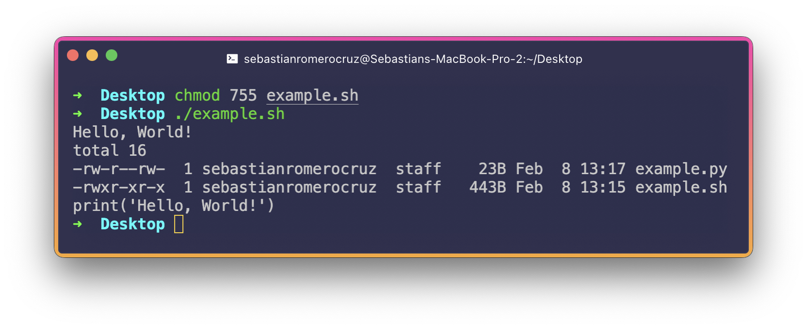
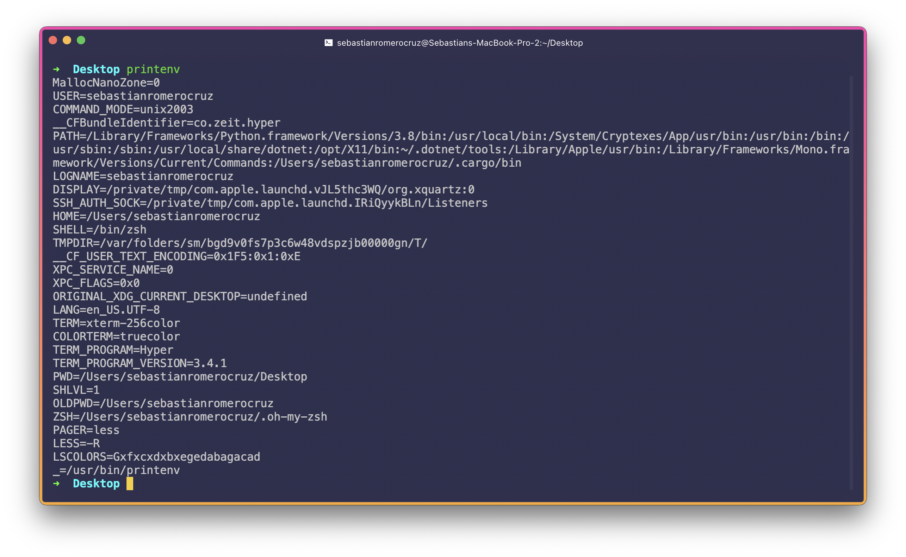
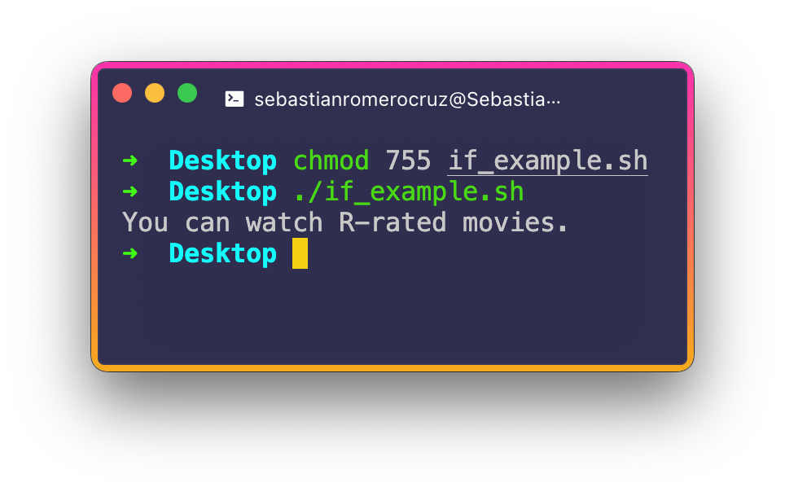
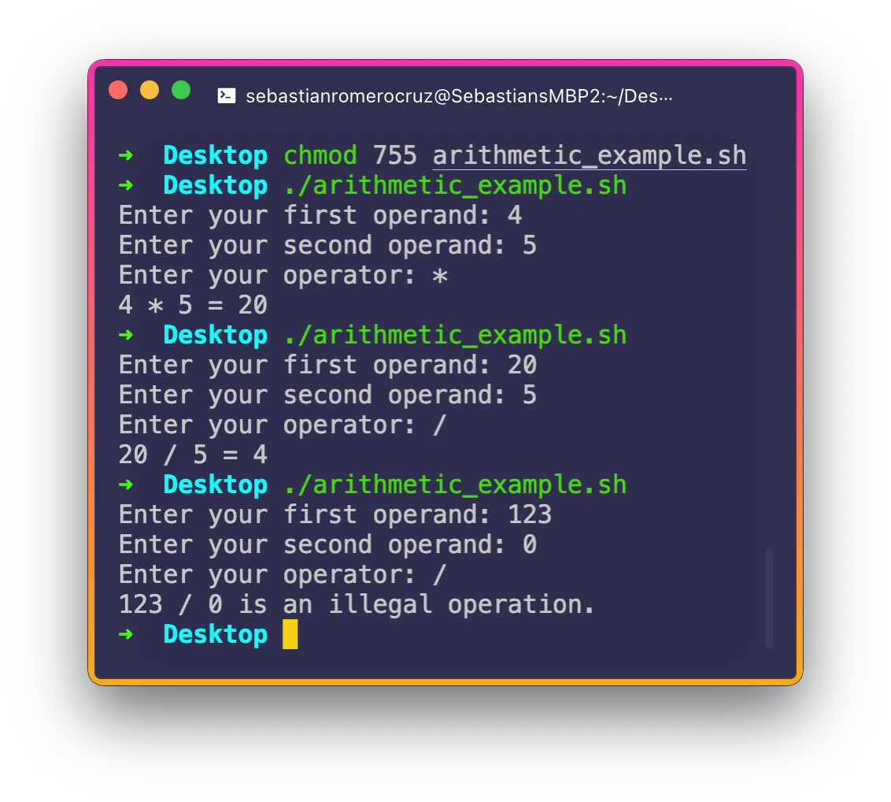
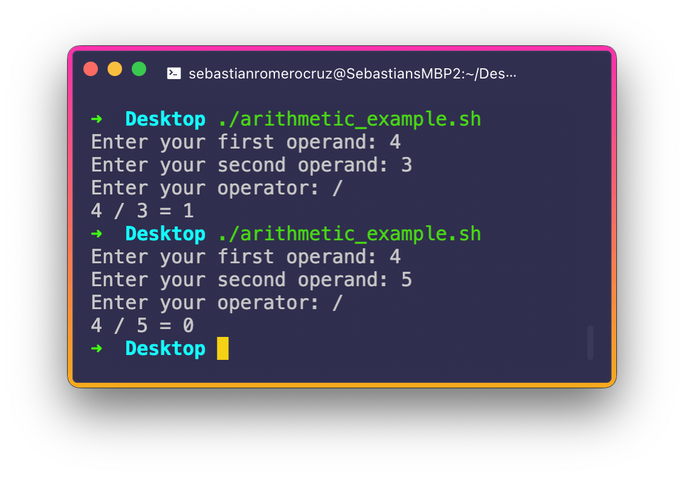

<h2 align=center>Week 05</h2>

<h1 align=center>Shells, Environments, Shell Programming I</h1>

<p align=center><strong><em>Song of the day</strong>: <a href="https://youtu.be/RF-SiHt7Cso?si=nh_MHib-t0DeD5nI"><strong><u>最終兵器、きみ (The Last of My Friends)</u></strong></a> by MOTHER (2023)</em></p>

### Sections

1. [**Shell Scripting Review**](#part-1-shell-scripting-review)
2. [**Local vs. Environment**](#part-2-local-vs-environment)
3. [**Variables**](#part-3-variables)
    1. [**Syntax**](#syntax)
    2. [**Usage**](#usage)
    3. [**Constants**](#constants)
    4. [**Deleting Variables**](#deleting-variables)
4. [**Selections**](#selections)
    1. [**`if`-Statements**](#if-statements)
    2. [**`else`-Statements**](#else-statements)
    3. [**`elif`-Statements**](#elif-statements)
    4. [**Arithmetic On User Input**](#arithmetic-on-user-input)

### Part 1: _Shell Scripting Review_

Let's quickly review what we know of shell scripting. Remember, way back in week 1, we were able to group several Terminal commands and executing them with a single executable by storing them in a file with the **`.sh`**, or [**shell**](https://github.com/sebastianromerocruz/CS271-material/tree/main/lectures/week-2#what-is-a-shell), extension. Let's write shell script that does the following:

1. Creates a new Python file called `example.py`.
2. Ensures the owner has writing permission for `example.py` (they should by default, but it never hurts to make sure).
3. Writes the line `print('Hello, World!')` directly into `example.py`.
4. Runs the file `example.py`.
5. Lists the contents of the current directory in long, human form.
6. Lists the contents of `example.py`.

The script would look like this:

```bash
#!/bin/sh

# Create a new Python file called `example.py`
touch example.py

# Ensure the owner has writing permission for `example.py`
chmod o+w example.py

# Write the line `print('Hello, World!')` directly into `example.py`
echo "print('Hello, World!')" > example.py

# Run the file `example.py`
python3 example.py

# Lists the contents of the current directory in long, human form
ls -lh

# Lists the contents of `example.py`
cat example.py
```

We should thus see the following when running it:



<sub>**Figure 1**: Remember we have to turn the `.sh` file into an executable by changing its permissions before running it.</sub>

This stuff can get pretty handy if your day-to-day job requires you to create a similar folder/file structure on a regular basis. But it actually gets much more powerful than this. Shell scripting is a full-fledged scripting language, like Python and Javascript, and as such, it contains the same programming structures that you can find in those two other languages as well. As this isn't a Shell scripting class, we won't delve super deep into this, but I'll show you the structures that you definitely need to know.

<br>

### Part 2: _Local vs. Environment_

Before we move on, I would just like to introduce the term **environment** when it comes to your Shell environment. When we talk about environment, or system-defined, values, we mean exactly that: values commonly used to configure the scripts and programs that are run by the Shell. Environment variables are only created once, after which they can be used by _any_ user.

In order to check what environmental values your computer has currently saved up, you can run the **`printenv`**, or **print environment**, command:

<a name="figure-2"></a>


<sub>**Figure 2**: Calling and output of the `printenv` command.</sub>

As you can see several uppercased symbols are listed as `printenv`'s output. These are actually _variables_ (specifically, **environment variables**), and you can see that they're storing some instantly recognisable data. For example:

- **`PWD`**: Contains the address of my current directory (`/Users/sebastianromerocruz/Desktop`).
- **`SHELL`**: As discussed in previous lectures, the OS's executable files are located in the `bin` folder. This particular environment variable holds the address of the executable of my shell, `/bin/zsh` (yours will most likely say `sh` or `shell` instead; [**`zsh`**](https://ohmyz.sh/) is simply another type of shell that builds upon the default shell that comes with your OS, **bash**).
- **`HOME`**: The location of the user's (i.e. my) home directory (`/Users/sebastianromerocruz`).

We can also create and modify environment variables if we so wish—I just want you to be aware of the difference before we go into creating them. There's no need to know what each of these variables is storing (although it probably wouldn't take you too long to figure it out).

### Part 3 _Variables_

#### Syntax

In Shell scripting, you can define variables by simply writing their names, using the assignment operator (`=`), and then specifying the value. Typically, _environment variables are uppercased and local (file-only) variable follow snakecase:

```bash
NEW_ENV_VAR="some important thing here"             # environmental variable
local_variable="some locally-important thing here"  # local variable
```

#### Usage

Now, in order to access the values of these variables for use, we need to preceed their symbol with a dollar sumbol **`$`**. For example:

In file `variables.sh`:

```bash
#!/bin/sh
name="Sebastian"

echo $name
```

Running:

```bash
chmod 755 variables.sh
./variables.sh
```

Output:

```bash
Sebastian
```

Watch your whitespace here. In Bash scripting, _you cannot place spaces between the assignment operator `=` and its operands_, because the Terminal uses spaces to determine the start and end of commands.

Here's a slightly more involved example:

```bash
#!/bin/sh
name="Sebastian"
age=30

echo "$name, $age-years-old, is the first name of the user $USER."
```

Output:

```
Sebastian, 30-years-old, is the first name of the user sebastianromerocruz.
```

As you can see, Shell scripting allows you to build nicely-formatted string using variables. Note that I used the environment variable `USER`, which you can also see in [**figure 2**](#figure-2).

#### Constants

In order to create constants in Shell scripting, you simply add the keyword **`readonly`** in front of your variable name. Attempting to change the value hence will result in the following error message:

```
./variables.sh: line 4: age: readonly variable
```

#### Deleting Variables

Finally, if for whatever reason you want to delete a variable (perhaps it hold sensitive information that you no longer need), you can use the `unset` keyword. Attempting to use the deleted variable does _not_ result in an error:

```shell
#!/bin/sh
name="Sebastian"
age=30
unset age

echo "$name, $age-years-old, is the first name of the user $USER."
```

Output:

```
Sebastian, -years-old, is the first name of the user sebastianromerocruz.
```

#### User Input

Finally, we can refine our program a little by asking the user to enter their name and their age. For this, you can use the following syntax:

```bash
read -p "A prompt message" variable_name
```

Where the `-p` option of the `read` command stands for "prompt" i.e. the message you are prompting the user with. Applying this here:

```bash
read -p "What is your name? " name 
read -p "How old are you? " age

echo "$name, $age-years-old, is the user '$USER'."
```

Output:

```
What is your name? Sebastián
How old are you? 30
Sebastián, 30-years-old, is the user 'sebastianromerocruz'.
```

### Part 4: _Relational / Comparison Operators_

Beyond numbers and characters, every programming language needs a way of comparing two or more values. These comparisons, where result in the boolean values _true_ and _false_, are arrived with the help of **comparison operators**. Shell scripting has two kinds of these–those for integer comparison and those for string comparison.

- **Integer Comparison Operators**:

| **Operator** | **Verbal Equivalent**                         |
|--------------|-----------------------------------------------|
| `-eq`         | _"Is A equal in value to B?"_                |
| `-ne`         | _"Is A not equal in value to B?"_             |
| `-gt`          | _"Is A greater in value than B?"_            |
| `-ge`         | _"Is A greater than or equal in value to B?"_ |
| `-lt`          | _"Is A less in value than B?"_                |
| `-le`         | _"Is A less than or equal in value to B?"_    |

<sub>**Figure 3**: Relational/comparison operators in shell scripting, where both A and B are _integer_ values.</sub>

- **String Comparison Operators**:

| **Operator** | **Verbal Equivalent**                                                         |
|--------------|-------------------------------------------------------------------------------|
| `=`        | _"Is A equal in value to B?"_                                                 |
| `!=`        | _"Is A not equal in value to B?"_                                             |
| `\>`        | _"Is A greater in lexicographical (ASCII/unicode) value than B?"_             |
| `\<`        | _"Is A less in lexicographical (ASCII/unicode) value than B?"_                |

<sub>**Figure 4**: Relational/comparison operators in shell scripting, where both A and B are _string_ values.</sub>

### Selections

#### `if`-Statements

Of course, the best use of condition statements is when they act upon the flow of the program. That is, when they decided if a specific instruction should be executed or not, and if so, how many times. The first of these structures is, of course, the **`if`-statement**. At it's simplest, the syntax looks like this in shell scripting:

```bash
if [ condition ]
then
    # some stuff
fi
```

That is:

1. Start with the `if` keyword.
2. Follow with the condition surrounded by square brackets `[]`.
3. In the next line, use the `then` keyword to signify that the code block is starting.
4. The instructions to be executed if the condition is true. Indentation is completely optional.
5. The `fi` keyword (which is literally just `if` backwards) to signify the end of the code block.

For example, if we wanted to check if somebody is old enough to watch an R-rated film (the age limit is 18-years of age), we would do:

```bash
#!/bin/sh
readonly age_limit=18
age=30

if [ $age -ge $age_limit ]
then
    echo "You can watch R-rated movies."
fi
```

Output:



<sub>**Figure 5**: Here, I made `age_limit` into a constant since this value is unlikely to change any time soon. However, this was not necessary–it was simply a stylistic choice.</sub>

#### `else`-Statements

If we have a way of executing code if the conditional statement evaluates to true, logic has it that we should have a way to execute code if it evaluates to false. This is the job of the **`else` keyword**:

```bash
if [ condition ]
then
    # do some stuff if it is true
else
    # do some stuff it it is false
fi
```

Using our above R-rated movie example and expanding on it, we would have:

```bash
#!/bin/sh
readonly age_limit=18
age=16

if [ $age -ge $age_limit ]
then
    echo "You can watch R-rated movies."
else
    echo "You need to be chaperoned by somebody who is $age_limit or older to watch R-rated movies."
fi
```

Output:

```
You need to be chaperoned by somebody who is 18 or older to watch R-rated movies.
```

#### `elif`-Statements

Finally, just like we do in Python, Shell programming also sports the `elif` keywords, which come handy when your decision tree can branch out into more than two paths. For example, if we wanted to wish the user a happy birthday if their age was exactly 18, we would do:

```bash
#!/bin/sh
readonly age_limit=18
read -p "How old are you? " age  # adding user input

# note that this changes to -gt now
if [ $age -gt $age_limit ]
then
    echo "You can watch R-rated movies."
elif [ $age -eq $age_limit ]
then
    echo "Happy birthday! Enjoy the film."
else
    echo "You need to be chaperoned by somebody who is $age_limit or older to watch R-rated movies."
fi
```

Output:

```
How old are you? 18
Happy birthday! Enjoy the film.
```

Notice that we didn't have to specify that the variable `age` needed to be an integer. Thankfully, _if you're not performing math on variables_ Bash programming will actually interpret this input based on the context in which it is being used. In the above case, it is being used in comparison with `age_limit`, an integer, so it is interpreted as an integer.

#### Arithmetic On User Input

If you _do_ want to perform math with the user input, you need to wrap your mathematical expression in what is called the **arithmetic expansion operator, or `$((...))`**. To illustrate this, let's write a simple Terminal-based calculator that will:

1. Ask the user for the left operand.
2. Ask the user for the right operand.
3. Ask the user for the operator.
4. Depending on which of the four operators they picked (`+`, `-`, `*`, or `/`), print the result in a nicely-formatted string.
    1. If the user picked division `/`, and the value of the second operand is _0_, print an error message telling them that it is an illegal calculation.
    2. If they didn't enter 0 for their second operand, perform step 4 as you would normally.

The solution is as follows:

```bash
#!/bin/sh
# Step 1
read -p "Enter your first operand: " first_operand

# Step 2
read -p "Enter your second operand: " second_operand

# Step 3
read -p "Enter your operator: " operator

# Step 4
if [ "$operator" = "+" ]
then
    echo "$first_operand $operator $second_operand = $((first_operand + second_operand))"
elif [ "$operator" = "-" ]
then
    echo "$first_operand $operator $second_operand = $((first_operand - second_operand))"
elif [ "$operator" = "*" ]
then
    echo "$first_operand $operator $second_operand = $((first_operand * second_operand))"
elif [ "$operator" = "/" ]
then
    if [ $second_operand -eq 0 ]
    then
        # Step 4.1
        echo "$first_operand $operator $second_operand is an illegal operation."
    else
        # Step 4.2
        echo "$first_operand $operator $second_operand = $((first_operand / second_operand))"
    fi
fi
```

Output:



<sub>**Figure 6**: Note here that, because we're using string comparison, in Shell programming we have to specify that our `operator` variable is going to be a string by surrounding it with double-quotes `""`. I know this sounds redundant, but remember we're dealing with a pretty different kind of programming here, so we have to change our thinking a little bit.</sub>

---

One last thing to keep in mind that **the Bash shell only performs integer arithmetic**. Attempting to, for instance, perform an irregular division would result in the following:



<sub>**Figure 7**: Basically, we're performing integer division here.</sub>
