<h2 align=center>Week 06</h2>

<h1 align=center>Shell Programming II, filters, <code>grep</code>, <code>egrep</code>, Regular Expressions, <code>sed</code></h1>

<p align=center><strong><em>Song of the day</strong>: <a href="https://youtu.be/RF-SiHt7Cso?si=nh_MHib-t0DeD5nI"><strong><u>最終兵器、きみ (The Last of My Friends)</u></strong></a> by MOTHER (2023)</em></p>

### Sections

1. [**`while`-Loops**](#part-1-while-loops)
2. [**`for`-Loops**](#part-2-for-loops)
3. [**Passing and Parsing Terminal Arguments and Parameters Using Bash**](#part-3-passing-and-parsing-terminal-arguments-and-parameters-using-bash)
4. [**Filters**](#part-4-filters)
    1. [**`grep`**](#grep)
    2. [**`Regular Expressions (regex)`**](#regular-expressions-regex)
    3. [**`egrep`**](#egrep)
5. [**`sed`**](#part-5-sed)

### Part 1: _`while`-Loops_

Let's pick up where we left off with Bash shell programming, shall we? Thus far, we've covered data storage through variables, some simple comparison and arithmetic, and selections (i.e. `if`, `elif`, `else`, and `fi`). So, our natural next step is to automate these processes by throwing them into _loops_. Just like in most modern procedural programming languages, we have two kinds of these available to us. In this section, we'll be covering the **`while`-loop**.

The general syntax of `while`-loops in Bash shell programming is as follows:

```bash
while [condition]
do
    # statements to loop
done
```

For example, if I wanted to do a simple counter starting at 1 and printing every number up until and including 10, we would do:

```bash
#!/bin/sh
readonly limit=10
number=1

while [ $number -le $limit ]
do
    echo $number
    number=$((number+1))
done
```

We can also use these `while`-loops for sentinel control—in other words, if we don't want the program to continue running until a certain condition is true (i.e. _while_ the condition is false). A quick example is this password checker:

```bash
#!/bin/sh
readonly stored_password="myPassword"

read -p "Enter your password: " password

while [ $password != $stored_password ]
do
    read -p "Incorrect password. Enter your password: " password
done

echo "Welcome!"
```

### Part 2: _`for`-Loops_

`for`-loops have a pretty similar syntax to Python's and look as follows:

```bash
for var in val1 val2 val3 ... valx valy valz
do
    # statements to loop
done
```

So, to print all the numbers from 1 to 10, one would do the following:

```bash
for number in 1 2 3 4 5 6 7 8 9 10
do
    echo $number
done
```

You can create something like a list of objects by including them inside of a string and separating them by a space character `' '`, as follows:

```bash
members="Hitori Ikuyo Ryō Kita"

for member in $members
do
    echo $member
done
```

Output:
```
➜  chmod 755 members.sh 
➜  ./members.sh 
Hitori
Ikuyo
Ryō
Kita
```

<br>

### Part 3: _Passing and Parsing Terminal Arguments and Parameters Using Bash_

The final thing that we will be learning about in shell programming is how we can pass arguments from the Terminal directly into our .sh files. To make this process neater, we can use the bash command when running our scripts. Instead of giving the owner of members.sh execute permissions, we can run it with bash executables.

```
➜  ./members.sh 
```

We would now be doing:

```
➜  bash members.sh 
```

Let's start with a simple example of a shell script that adds two numbers together. When called, the output would appear like this:

```
➜  bash adder.sh 4 5
4 + 5 = 9
```

The script would look as follows:

```bash
#!/bin/bash
operand_a=$1
operand_b=$2

result=$((operand_a+operand_b))

echo "$operand_a + $operand_b = $result"
```

As you can see, the way we referenced the scripts **parameters**, which hold the values `4` and `5`, was by using the dollar symbol `$` followed by the ordinal numbers `1` and `2`, since we were expecting two arguments for our script.

Be careful to remember that bash scripts don't ever really tell report errors the way Python or Java might. This is to say that, if we ran `adder.sh` but didn't enter exactly 2 arguments, the code would still execute:

```
➜  bash adder.sh    
 +  = 0
➜  bash adder.sh 10 
10 +  = 10
➜  bash adder.sh 42 3 20
42 + 3 = 45
```

If the user can enter any amount of arguments into the program, then we use the **`@`** symbol in order to represent that _list of parameters_. The symbol **`#`**, in turn, represents the _amount of arguments_ the user gave. 

A simple example is a program that calculates the floor-average (since we can only perform integer division) of user entered integers, where the user can type as many numbers as arguments as they wish:

```bash
#!/bin/sh

readonly amount=$#
sum=0

for number in $@
do
    sum=$((sum+number))
done

average=$((sum/amount))

echo "The floor-average of [$@] is $average."
```

Potential outputs:

```
➜  bash average.sh 4 42 100 57 45
The floor-average of [4 42 100 57 45] is 49.
➜  bash average.sh 1 2 3         
The floor-average of [1 2 3] is 2.
➜  bash average.sh      
average.sh: line 11: sum/amount: division by 0 (error token is "t")
The floor-average of [] is .
```

### Part 4: _Filters_

Next up, let's talk about **filters**. These are a set of powerful commands that take input from standard input, perform a set of operations, and write output to standard output. What's special about these commands is that we can specify exactly what kind of output we want from these operations. For example, we can ask these commands to search through a file for a specific word or set of words and it will display the locations in the file where this argument appears, if at all. Let's look at some of these.

#### **`grep`**

**`grep`** is arguably the most popular of these filter commands. In essence, it is a searching and file manipulating tool using _text patterns_ within files. It's name derives, quite literally, from what it does:

- **`g`**: Globally search for a...
- **`re`**: ...regular expression (more on these later) and...
- **`p`**: print matching lines.

It's basic syntax is as follows:

```bash
grep [options/flags] pattern [files]
```

Where some of the most common options are as follow:

|Option|Description|
|-|-|
|`-c`| This prints a count of the lines that match a pattern |
|`-h`| When displaying the matched lines, do not display the filenames |
|`–i`| Ignore case when matching |
|`-l`| Displays list of a filenames only |
|`-n`| Display the matched lines and their line numbers. |
|`-v`| This prints all the lines that do _not_ match the pattern |
|`-e exp`| Specifies the desired expression with this option. Can be used multiple times |
|`-f file`| Takes patterns from file, one per line |
|`-w`| Matches the whole word |

As a quick example, consider the `README.me` file I am writing in right now. If I wanted to:

- Ask `grep` to perform a case-insensitive search for the characters `average`, I would do the following:

```bash
grep -i "average" README.md
```

Output:

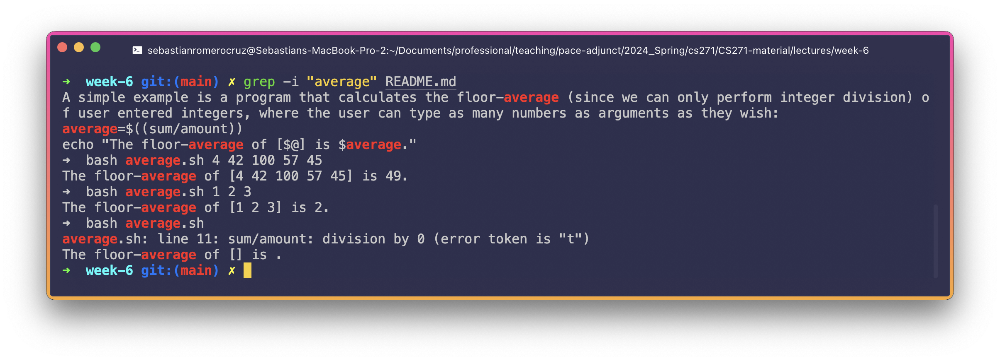

<sub>**Figure 1**: Note the instances of the expression `average` appear in red.</sub>

- Another example, using the expression `readme`:

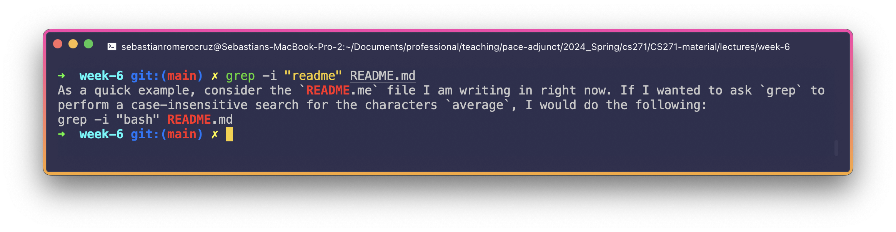

<sub>**Figure 2**: Note the case-insensitivity.</sub>

- A third example, but this time requesting the amount of times the expression `loop` appears:

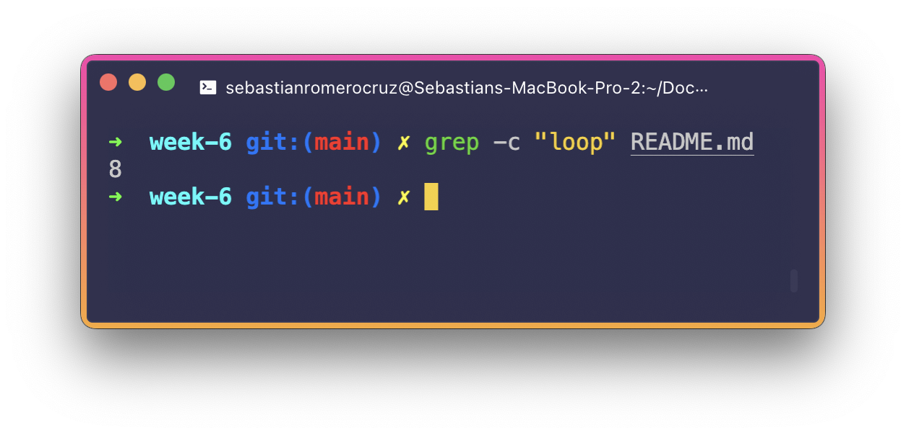

<sub>**Figure 3**: Note that, here, since we don't have the `-i` flag, this is a _case-sensitive_ search.</sub>

- Using the `-l` flag to list the locations where this pattern appears:

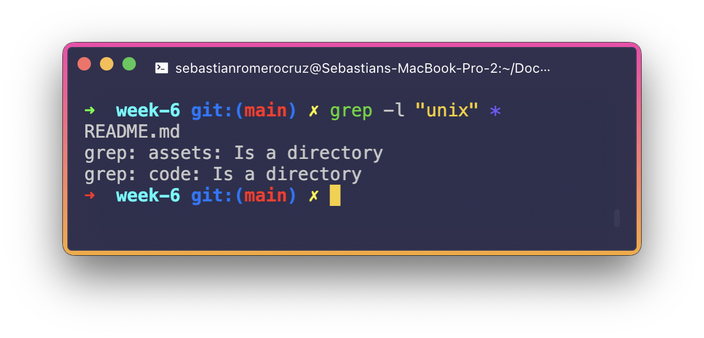

<sub>**Figure 4**: Displaying the file names that match the pattern `unix`.</sub>

- Using the `-n` flag:

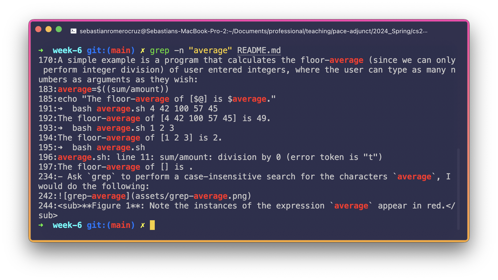

<sub>**Figure 5**: Showing line numbers while displaying the output using `grep -n`.</sub>

#### Regular Expressions (regex)

Before we move further into filters, learning about **[regular expressions](https://en.wikibooks.org/wiki/Regular_Expressions/POSIX-Extended_Regular_Expressions), or regex** is in order. Regex is a bit of a monster of a topic that can take quite a while to really learn how to use, and that is because there are so many ways to use it. What they basically are is a pattern specifier for a specific string that you interested in. We'll be diving into very simple examples here.

- For example, let's say you were interested in searching for lines in a file that ended with the characters `"syntax."`. With regex, this would look as follows:

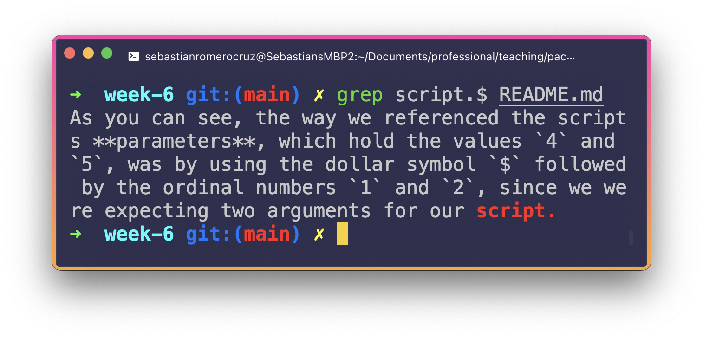

<sub>**Figure 6**: Using `$` (dollar sign) to match the ending of the _string_.</sub>

This is essentially what they do—give you the flexibility to filter your search so that you can be a bit more specific.

- The counterpart to `$` is the caret symbol, `^`, which works with the beginning of lines instead:

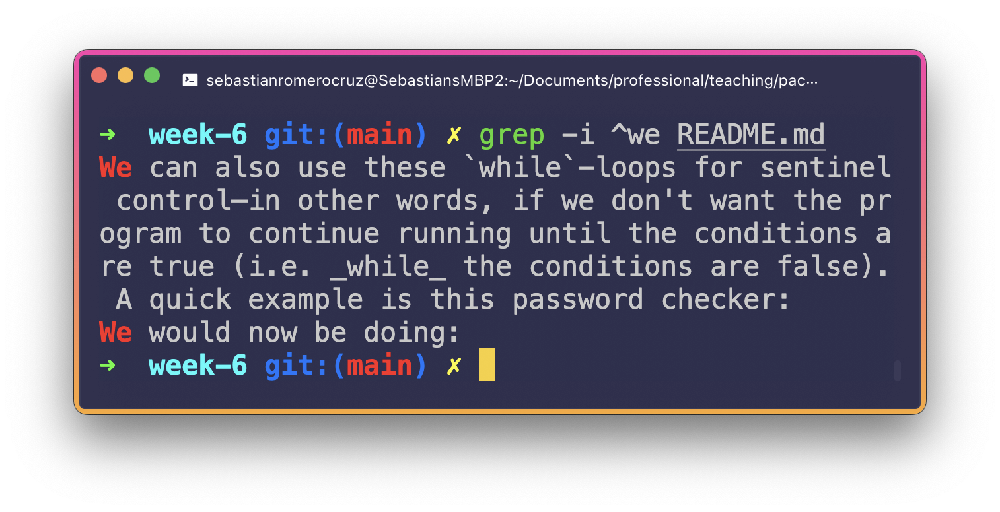

<sub>**Figure 7**: Using `^` (caret) to match the beginning of the _string_.</sub>

- We can use the `.` character if we don't know the exact spelling of a specific word. For example, say we wanted to print all lines that contained an 11-string substring that starts with the character `"E"`, and ends with the character `"s"` (looking for the word `"Expression"` here) you could do the following:

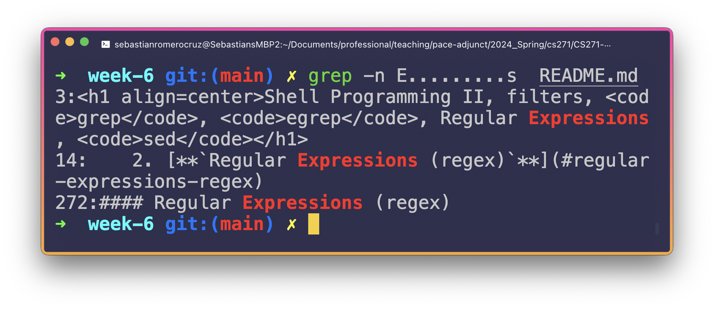

<sub>**Figure 8**: Using `.` (dot) to match _strings_.</sub>

<!-- - The star symbol `*` can help us find all lines with one or more occurrences of a string pattern one after another in it. For example -->

- We can use a set of parentheses `()` to find all lines that contain instances of a specific pattern. For this, we need the use of the `-E` flag for `grep` (more on this in the next section). For example, if we wanted to find the number of lines that contain instances of the characters `"ing"`, we would do the following:

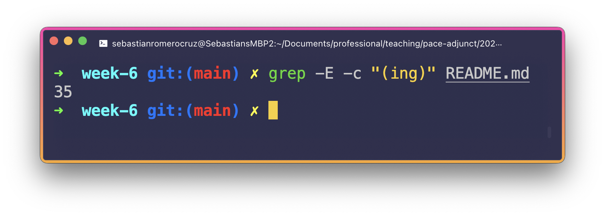

<sub>**Figure 9**: Using `()` (parentheses) to match the group of regex.</sub>

- If you have multiple characters that you want to search up, you can use the `?` question mark character. For example, let's say we wanted to search up all instances of lines that contain substrings with `"Le"` and `"L"`, we would do the following:

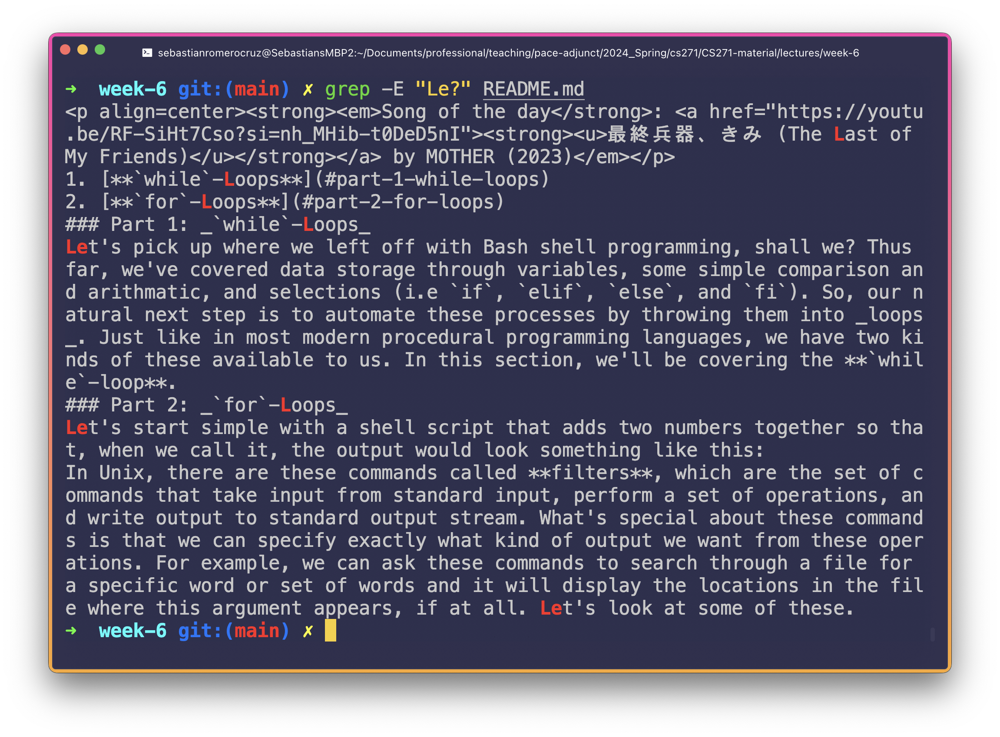

<sub>**Figure 10**: Using `?` (question mark) to find all the matching characters.</sub>

#### **`egrep`**

This **`-E`** flag stands for **extended regular expression**. There are a few differences between extended regular expressions and basic regular expressions, but the main ones are that we can use characters like `?`, `.`, `*`, `^`, etc. without having to worry about them being interpreted as part of the string that we are searching for (e.g. `"Le?"` recognises the `?` as a multiple character search, and not as the question mark character being part of the string. If we did want the question mark character to be part of the string, we would have to add an escape character `\` to make it a string literal i.e. `"Le\?"`).

Unix-based operating systems have a command called **`egrep`** that is essentially `grep` with the `-E` option enabled by default. Meaning that the following line:

```bash
grep -E "loop?" README.md 
```

Is equivalent to the following:

```bash
egrep "loop?" README.md 
```

### Part 5: _`sed`_

Finally, we'll talk about a command that not only searches up patterns, but also modifies them to any specifications that you give it: **`sed`**. With `sed`, you can do the following:

- Select text
- Substitute text
- Add lines to text
- Delete lines from text
- Modify (or preserve) an original file

As a simple example, let's send in `"Hello World!"` into `sed` using `echo`, and ask it to replace all instances of a space character `" "` with the following `", "`:

```
➜  echo Hello World! | sed 's/ /, /'                       
Hello, World!
```

Or maybe replace `"CS271"` with `"Intro to Unix and C"`:

```
➜  echo Welcome to CS271! | sed 's/CS271/Intro to Unix and C/'
Welcome to Intro to Unix and C!
```

The pattern is as follows:

```bash
sed 's/original/replacement'
```

Where `s` in this case stands for substitution. This is just the beginning, though. Another thing `sed` can do is isolate lines from a file. 

- For instance, let's say I wanted to get lines 20 to 30 from my `README.md` file. We would do the following:

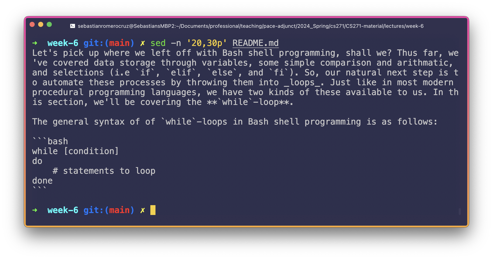

<sub>**Figure 11**: Here, the `','` is denoting our range, the `'p'` instructs `sed` to print the isolated lines.</sub>

- To select multiple ranges, use the `-e` (expression) option _before each of the ranges_. Here, I am printing lines 20-30 and 50-60 (the `-n` flag prints only the lines that were changed):

```
➜  sed -n -e '20,30p' -e '50,60p' README.md
Let's pick up where we left off with Bash shell programming, shall we? Thus far, we've covered data storage through variables, some simple comparison and arithmatic, and selections (i.e `if`, `elif`, `else`, and `fi`). So, our natural next step is to automate these processes by throwing them into _loops_. Just like in most modern procedural programming languages, we have two kinds of these available to us. In this section, we'll be covering the **`while`-loop**.
```

The general syntax of of `while`-loops in Bash shell programming is as follows:

```bash
while [condition]
do
    # statements to loop
done
```

```
1
2
3
4
5
6
7
8
9
10
```

- Naturally, we won't always know where the text we're looking for is located in the file, which means that we'll have to ask `sed` to select lines that contain matching text patterns insteal. For example, let's extract all lines that start with `"We"`:

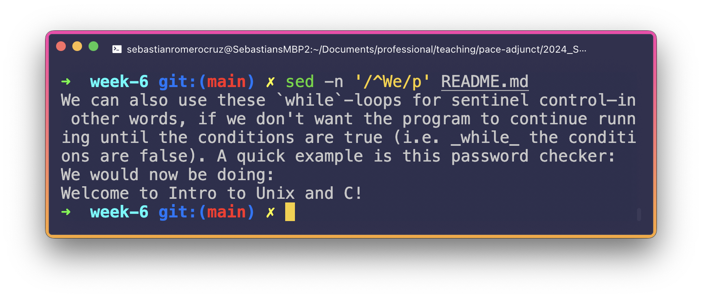

<sub>**Figure 12**: The caret (`^`) represents the start of the line. We then enclose our search term in forward slashes (`/`).</sub>

- We can achieve more complex substitutions by putting what we know together. I've created a new `txt` file by using `touch` and `cat` here:

```
➜  touch example.txt
➜  cat > example.txt  
I am just putting some stuff in here
And then we can replace it with some other stuff and substitute it for 
example purposes
It just works like that
```

Say, for example, that we wanted to replace all instances of `it` with `that`, and we tried the above `s/original/substitution` method:

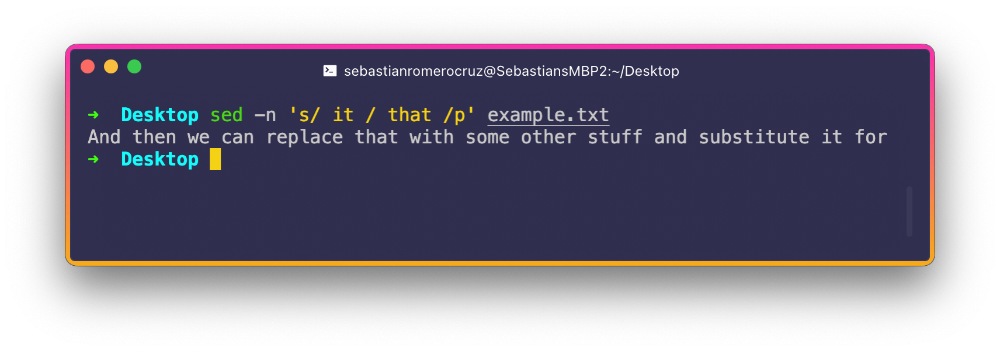

<sub>**Figure 13**: What happened?</sub>

Only the first instance of `it` got replaced, right? This is because `sed` stops after the first match _per line_. So, next to `p`, we can add the `g` key character (which stands for global) to ask `sed` to cover all instances of `it`. While we're at it, adding the `i` key character will make this operation case-insensitive:

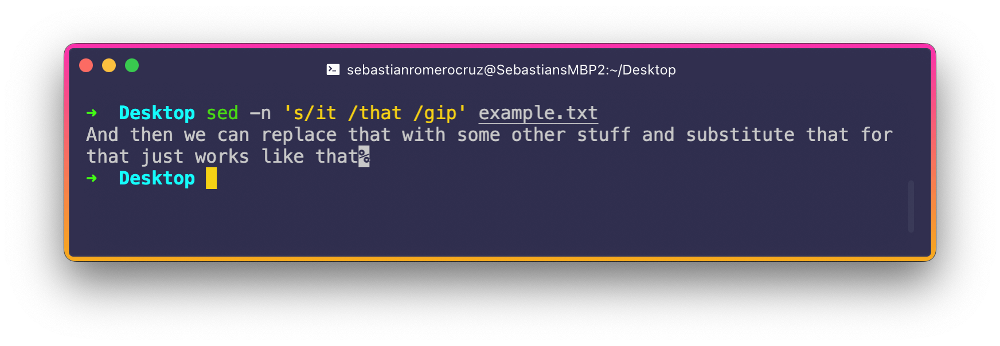

<sub>**Figure 13**: Signed, sealed, delivered.</sub>

Note that this doesn't modify the file itself, but is simply printing the result into the standard output.

- Sometimes, though, you might not want to deal with global case-insensitivity. What I mean by this is, what if you wanted to consider instances of both `I` and `i`, but all other letters in a case-sensitive way? The key for this is to use **regrex groups, which we enclose in square brackets `[]`**. Our above example would thus looks like this:

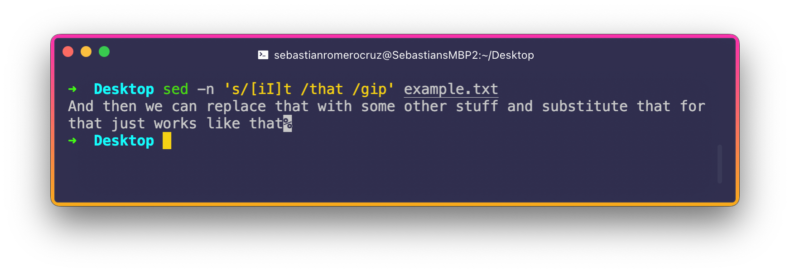

<sub>**Figure 14**: That is, replace all instance of both `It` and `it` with `that`.</sub>

This can be especially helpful when creating clean data files from raw data files that might have some corrupted data. For example, say we had a file (`raw_temps.txt`) that contained some temperature data, where the word `null` represents an invalid value:

```
32.3
30.5
31.0
28.0
INVALID
30.9
INVALID
```

We naturally cannot perform math on such a sequence of numbers, so let's create a second file and change all `INVALID` value to `0.0` instead:

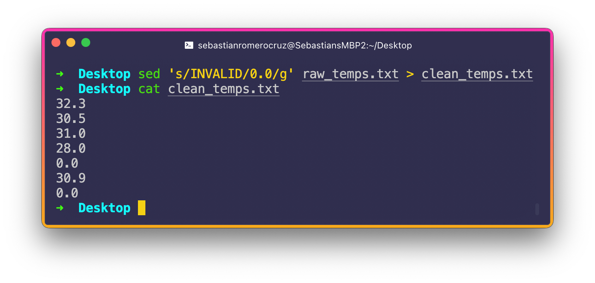

<sub>**Figure 15**: Notice here that I removed the `p`. If I hadn't the `0.0` would have appeared twice, since `p` prints those values.</sub>

And we really can go on. With the power of regex and `sed` combined, there is so much you can do. Regex in and of itself is art to be mastered that, should you ever have the time, should go deeper into. You homework will involve getting more closely acquainted with some of these patterns, as this lecture has already gone on for quite a long time.