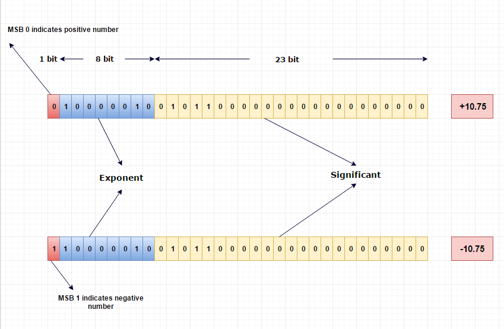

<h2 align=center>Week 08</h2>

<h1 align=center>Introduction to C, <code>char</code>, Strings, <code>int</code>, <code>float</code>, Standard Library</h1>

<p align=center><strong><em>Song of the day</strong>: <a href="https://youtu.be/qzvIZi9MqIU?si=tm2t-2K9s-7QXa2e"><strong><u>It's the 2 n 4 n tambourine</u></strong></a> by LambC 램씨 (2024)</em></p>

### Sections

1. [**Hello World in C and `gcc` Review**](#part-1-hello-world-in-c-and-gcc-review)
2. [**Basic Data Types**](#part-2-basic-data-types)
    1. [**`int`**](#int)
    2. [**`float`**](#float)
    3. [**`char`**](#char)
    4. [**Strings (`char` Arrays)**](#strings-char-arrays)
3. [**The Standard Library**](#part-3-the-standard-library)

### Part 1: _Hello World in C and `gcc` Review_

Let us recall the contents of our _Hello World_ program we wrote in C all the way back in [**week 1**](https://github.com/sebastianromerocruz/CS271-material/tree/main/lectures/week-1#copy-and-paste-the-c-hello-world-equivalent):

<a name="hello-world"></a>

```c
#include <stdio.h>

int main(void)
{
    printf("Hello, World!\n");
    return 0;
}
```

If you're familiar with Java, the syntax shouldn't be too unfamiliar. A rough Java equivalent would look as follows:

```java
public class HelloWorld {
    public static void main(String[] args) {
        System.out.println("Hello, World!");
    }
}
```

In terms of similarities, both C and Java:
- Use braces `{}` in order to create code blocks.
- Use semicolons `;` in order to terminate lines of code.
- Need to run code inside of a function called `main`.

In terms of differences:
- Unlike Java, we need to explicitly include C's standard library.
- Unlike Java, the `main` function in C returns an integer (`int`). In this case, we are returning `0`. 
    - While this line is actually optional, returning `0` is traditionally used to indicate that the program was successfully run.
    - For example, if the program failed to run because of say, a lack of memory, you could return `-1`, or maybe `-2` if it failed to run because the opening of a file was unsuccessful.
- Unlike Java, the `main` function is not defined in a class definition. In fact, **the C language doesn't have classes at all**—it is not object-oriented.
- Unlike Java, the `main` function (in this form, anyway) takes the `void` keywork as its only parameter. You may actually see variations of this across C files online. Some examples include:
    - **`void main()`**: More similar to Java, but not universally supported across compilers.
    - **`int main(void)`**: This variation and the one below are common when the C program is not taking any command line arguments when running.
    - **`int main()`**: There are slight differences between `()` and `(void)`, but for the purposes for this class, they both mean that a function takes no parameters (I tend to favour `(void)` in C).
    - **`int main(int argc, char **argv)`**: The syntax of these last two may look a little abstract for now, but they both are essentially accepting:
        - **`argc`**: The number of command line arguments used when running this program.
        - **`argv`**: The actual contents of these command line arguments.
    - **`int main(int argc, char *argv[])`**: See above.

So, if we were to interpret our [**program from earlier**](#hello-world), we would would read it as follows in English:

1. Import the standard IO library into our program.
2. Create our program's `main` function, which will be the entry point to our C application, such that it doesn't expect any arguments from the command line when being compiled and run.
3. Print the string of `char` values `"Hello, World\n!"` into the standard output. I say _string of `char` values_ because that is what they literally are. _There are no strings in C_, just arrays of `char`s. More on this later.
4. Return `0`, as our program was successful.

<br>

### Part 2: _Basic Data Types_

C's basic types are kind of similar to Java's [**primitives**](https://github.com/sebastianromerocruz/CS122-material/tree/main/src/03-variables-constants#numerical-types/) (missing here are the `char` type, which uses the same keyword in C, and `boolean`, which uses the `bool` keyword in C), but we'll go in depth with the three most relevant to us right now.

#### ***`int`***

A C integer type (`int`) is your basic signed (that is, it can be both positive and negative) whole number value. By itself, it can hold any number in the range `[−32,767, +32,767]`, and you create one like such:

```c
int year = 1967;

printf("A good year in music was %d\n", year);
```

Output:

```
➜  gcc -o Week8 week_8.c                                               
➜  ./Week8       
A good year in music was 1967
```

Take a look at how I formatted our `printf` call. `printf` actually stands for "formatted-print", and it's where f-strings in Python get their syntax. Essentially, you type out your desired string as the first argument of `printf`, using _placeholders_ for the values that you want to insert into that string. Then, you place those values as subsequence arguments to the `printf` function.

For integers, you can use either `%d` (for digit) or `%i`, but I do tend to see the former more often.

Technically, C integers can exist in _8 different forms_, depending on their use case. Keep in mind that C was created in a time where memory management was of paramount important, so a programmer had to be extremely cautious about the amount of memory they reserved to store our data. For that reason, integers in C (and C++) have the following forms:

|Keyword(s)|Size (in Bytes)|Explanation and Range|Format Specifyer|
|-|-|-|-|
|**`int`**|4|Our standard integer discussed above, used in situations where it makes sense for a number to be able to be negative (i.e. mathematical calculations)|`%d` or `%i`|
|**`unsigned int`**|4|Able to hold any number in the range `[0, 4294967295]`, it is used in situations where negative numbers don't make sense, such as indices, memory addresses, identification numbers, etc.|`%u`|
|**`short`**|2|Same as an `int`, but with the range of values of `[-32768, 32767]`|`%hd`|
|**`unsigned short`**|2|Same as an `unsigned int`, but with the range of values of `0 to 65535`|`%hu`|
|**`long`**|8|Same as an `int`, but with the range of values of `[-9223372036854775808, 9223372036854775807]`|`%ld`|
|**`unsigned long`**|8|Same as `unsigned int`, but with the range of values of `[0 to 18446744073709551615]`|`%lu`|
|**`long long`**|8|In some platforms, `long long` and `long` refer to the same size, but in other platforms, `long long` can be _double_ the size of `long`|`%lld`|
|**`unsigned long long`**|8|See above|`%llu`|

<sub>**Figure 1**: Types of integers in C.</sub>

#### ***`float`***

You very likely know what floats (i.e. floating-point values) are (at least, I _really_ hope you do by now): numbers that have a decimal component. These numbers are stored in 4 bytes of memory in C (i.e. 34 bits). These bits are broken down into three sections in memory:

1. **Bit 1 (Most Significant Bit, or MSB)**: The sign of the float (0 for positive, 1 for negative).
2. **Bits 2 to 9**: The power of 2 by which we [**normalise**](https://www.log2base2.com/storage/how-float-values-are-stored-in-memory.html) the value of the float.
3. **Bits 10 to 32**: The [**binary representation**](https://www.log2base2.com/number-system/float-to-binary-conversion.html) of the actual float.



<sub>**Figure 2**: Visual representation of how 10.75 is stored in memory ([**Source**](https://www.log2base2.com/images/storage/how-float-values-are-stored-in-memory.png)).</sub>


The `double` type also exists in C, but it is recommended that you only use it when a precision higher than _7 significant figures_ is needed (which is the limit if a `float`). Floats in C use the `%f` format specifier, whereas doubles use `%lf`.

```c
#include <stdio.h>

int main(void)
{
    double speed_of_light = 299792458.00002;
    float acceleration_of_gravity = 9.81f;

    int size_of_double = sizeof(speed_of_light);
    int size_of_float = sizeof(acceleration_of_gravity);

    printf("The size of a double is %d bytes.\n", size_of_double);
    printf("The size of a float is %d bytes.\n", size_of_float);

    return 0;
}
```

Output:

```
➜  gcc -o Week8 week_8.c
➜  ./Week8              
The size of a double is 8 bytes.
The size of a float is 4 bytes.
```

Notice the little `f` character I added after the value of `acceleration_of_gravity`. This is common practice, and it's sometimes necessary since C will actually make all non-declared numbers with decimals `doubles` by default:

```c
#include <stdio.h>

int main(void)
{
    printf("The size of %lf should be 4 bytes, but it is instead %lu.\n", 3.14, sizeof(3.14));
    printf("However, if we instead write '%lff', we will get the correct size: %lu.\n", 3.14f, sizeof(3.14f));

    return 0;
}
```

Output:

```
➜  gcc -o Week8 week_8.c
➜  ./Week8              
The size of 3.140000 should be 4 bytes, but it is instead 8.
However, if we instead write '3.140000f', we will get the correct size: 4.
```

<br>

#### ***`char`***

You should be familiar with the `char` type from your Java days. These data types are used to represent any letter, piece of script, and symbol in a way that makes it readable in our computer screens. `char` values take up a single byte in memory and, behind the scenes, are actually (unsigned) integers in disguise. The reason for this is because all characters correspond to an integer assigned to them by some numerical code, of which the most famous is [**ASCII**](https://www.alpharithms.com/ascii-table-512119/):


<sub>**Figure 2**: The ASCII (American Standard Code for Information Interchange) Table.</sub>

So we can actually print a C `char` value as bath a character (using `%c`) _and an integer_:

```c
#include <stdio.h>

int main(void)
{
    char initial = 'S';
    printf("My first-name initial is %c, which corresponds to the ASCII value %d.\n", initial, initial);

    return 0;
}
```

Output:

```
➜  gcc -o Week8 week_8.c
➜  ./Week8              
My first-name initial is S, which corresponds to the ASCII value 83.
```

Keep in mind that, just like in Java, `char` values _must_ use single quotes (`''`). Double quotes (`""`) are reserved for strings, which is what we will be covering next.

<br>

#### ***Strings (`char` Arrays)***

You'll often hear programmers joke about how, as soon as C-styled strings get involved, they start running as fast possible in the opposite direction. There's certainly some valid reasons to be annoyed at the way string in C work—especially if you're coming from a Python or Java tradition.

Remember how I said that C was not an object-oriented language? This makes a world of difference when it comes to strings, since in both Python and Java, strings are **objects** of the `str` and `String` class, respectively. Since classes can only exist in languages that support object-oriented programming (OOP), how on Earth does C manage it? Clearly, we printed a string from the very beginning of the semester, and it didn't look so terribly different from what we've seen in other languages:

```c
#include <stdio.h>

int main(void)
{
    printf("Hello, World!\n");
    return 0;
}
```

C strings are, instead of objects, quite literally that: a string, or an _array_, of `char` values. In fact, when we declare a string, we _have to do_ the following in C:

```c
char string_name[size_of_string];
```

There is no `String` or `string` keyword like there is in both Java and C++. Meaning that, if we're going to declare a string variable, _we need to know how long this string will be beforehand_ so that it knows how much memory to reserve beforehand. 

<br>

That's the first confusing thing about C strings, but certainly not the last. If I created the following `char` array in C, what would you guess its size to be?


```c
char band_name[] = "Velvet Underground";
```

The reasonable answer here would be to say 18, since there are 18 characters in the string `"Velvet Underground"`. But is that the of the string equal to the size of the `char` array. The answer is _almost_. C `char` arrays are special in that they _always_ add a special (hidden) character at the end of every string called the **null character(`'\0'`)**:

```
    char band_name[] = "The Vaccines";
                              |
          ____________________」
          |                 
          v
        {'T', 'h', 'e', ' ', 'V', 'a', 'c', 'c', 'i', 'n', 'e', 's', '\0' }
Index:    0    1    2    3    4    5    6    7    8    9    10   11    12
```

Because of this, if we anticipate that we will be storing a data of size, say _N_, we should always make sure that our `char` is declared with _at least N + 1_ spots of memory.

<br>

So, we already saw how to create a string by giving its initial value and by declaring it. Here are a couple of other things you can do:

- Assigning a string to a `char` array of a predetermined size:

```c
char game_boy_memory[4800] = "GAME_NAME: 'The Legend Of Zelda'; SAVE_DATA:";
```

- Assgning a string character-by-character to a `char` array:

```c
// Make sure to NOT forget the null character!
char band_name[] = {'T', 'h', 'e', ' ', 'V', 'a', 'c', 'c', 'i', 'n', 'e', 's', '\0' };

// This also works if your array is a pre-determined size:
char band_info[100] = {'T', 'h', 'e', ' ', 'V', 'a', 'c', 'c', 'i', 'n', 'e', 's', '\0' };
```

Of course, if you tried to do any of the above and the string was larger than the size of the array, you would get the following compiler error:

```c
#include <stdio.h>

int main(void)
{
    /* STRINGS */
    char band_name[5] = "Velvet Underground";

    return 0;
}
```

Output:

```
➜  gcc -o Week8 week_8.c
week_8.c:27:25: warning: initializer-string for char array is too long [-Wexcess-initializers]
    char band_name[5] = "Velvet Underground";
                        ^~~~~~~~~~~~~~~~~~~~
1 warning generated.
```

<br>

Finally, the format specifier for strings is `%s`:

```c
#include <stdio.h>

int main(void)
{
    /* STRINGS */
    char band_name[] = "Velvet Underground";
    printf("I am listening to %s as I write these notes.\n", band_name);

    return 0;
}
```

```
➜  gcc -o Week8 week_8.c
➜  ./Week8              
I am listening to Velvet Underground as I write these notes.
```

We'll learn much more about strings as the rest of the semester carries out, but let's leave it there for now and go touch some grass, shall we?

### Part 3: _The Standard Library_

Like its file name implies, C's standard library `stdio.h` contains a bunch of functions, values, and even types that deal with hooking C up with our machine's standard input (keyboard) and output (Terminal). Possibly the most common of these, and the one that we have been using over and over this week is the **`printf`** function, whose official documentation lists the following:

#### DESCRIPTION
The C library function int `printf(const char *format, ...)` sends formatted output to stdout.

#### DECLARATION
Following is the declaration for `printf()` function.

```c
int printf(const char *format, ...)
```

#### PARAMETERS

- **`format`**: This is the string that contains the text to be written to stdout. It can optionally contain embedded format tags that are replaced by the values specified in subsequent additional arguments and formatted as requested. Format tags prototype is `%[flags][width][.precision][length]specifier`, which is explained [**here**](https://www.tutorialspoint.com/c_standard_library/c_function_printf.htm).

<br>

Aside from `printf`, we will be exploring a variety of functions and values from her through this latter half of the semester to help us get data from and to places, whether that be the user or a file. Some example include:

- **`int scanf(const char *format, ...)`**: Reads formatted input from standard input.
- **`int puts(const char *str)`**: Writes a string to stdout up to but not including the null character. A newline character is appended to the output. Like `printf` without the formatting aspect.
- **`NULL`**: A sort of constant that represents the absence of data.
- **`EOF`**: A negative integer, which indicates that the end of a file has been reached.
- **`FILE *fopen(const char *filename, const char *mode)`**: Opens the filename pointed to by filename using the given mode (i.e. `"r"` for read-mode, etc.)